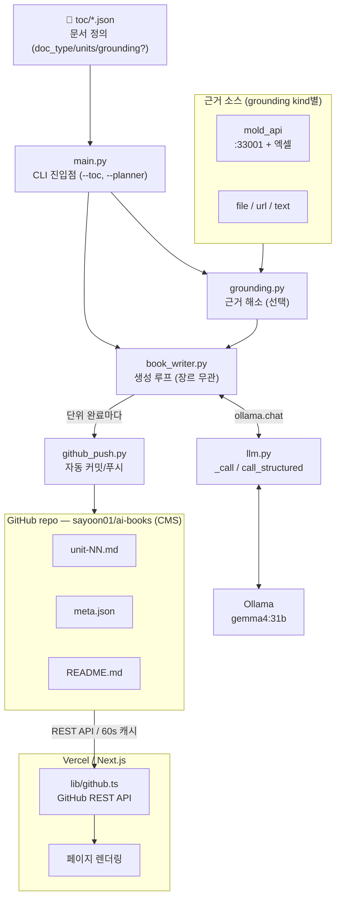
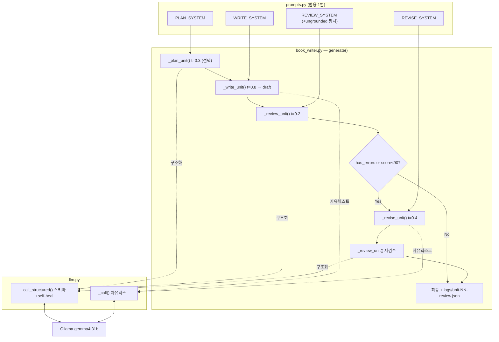

# AI Books — 프로젝트 아키텍처

## 개요

로컬 LLM(Ollama + Gemma 4 31B)으로 **문서를 작성 단위(unit)별로 자동 생성**하고, GitHub에 커밋한 뒤 Vercel의 Next.js 앱에서 읽어 웹에 게시하는 파이프라인입니다.

핵심 설계: **파이프라인은 장르 무관(genre-agnostic)**. 책·기술분석서·소설 등 문서 유형은 코드가 아니라 **`toc/*.json`의 필드(`doc_type` 등)** 가 결정합니다. 실측 근거가 필요한 문서는 **선택 필드 `grounding`** 으로 파일/링크/API의 사실을 주입받습니다(없으면 모델 지식으로 작성).

> 이전에는 책 전용 파이프라인이었으나, 2026-06 일반화되었습니다. (구) `chapters`/`sections` → (신) `units`, (구) `_parse_review` 정규식 → (신) `call_structured` Pydantic 수렴.

---

## 1. 시스템 전체 흐름



---

## 2. 입력 — `toc/*.json` 통합 스키마

문서 한 개는 `toc/*.json` 하나로 정의합니다. 모든 장르가 같은 스키마를 씁니다.

```jsonc
{
  "title": "...",
  "language": "ko",
  "doc_type": "기술분석서",          // 모델에게 정체성만 전달. 코드는 분기하지 않음
  "description": "...",
  "target_reader": "...(독자 + 문체)", // book_style 흡수: 독자층과 톤을 한 필드에
  "writing_guidelines": ["..."],
  "grounding": { "kind": "mold_api", ... },   // 선택. 없으면 모델 지식으로 작성
  "units": [                          // chapters/sections 통일 (옛 키는 폴백 인식)
    { "number": 1, "title": "...", "description": "...", "must_cover": ["..."] }
  ]
}
```

- **config**(문서 의도) = `units`·`grounding`을 제외한 전부 → 모든 단계 프롬프트에 주입
- **units** = 작성 단위 목록. `book_writer._units()`가 `units → chapters → sections` 순으로 폴백
- `must_cover` 같은 단위 필드는 자유 — 기술서는 `must_cover`, 소설은 `description`에 플롯 비트 등

---

## 3. grounding — 선택·다형 근거 레이어 (`grounding.py`)

`grounding`이 있으면 해소해 프롬프트에 "실측 근거" 블록으로 주입하고, 없으면 모델 지식으로 작성합니다.

| `kind` | 동작 | payload | ref_keys(계획 검증용) |
| --- | --- | --- | --- |
| `mold_api` | `:33001 /api/*` + 엑셀 사전 → `DataDigest`(통계 압축) | digest JSON | `flatten_keys()` |
| `file` | 로컬 파일(.md/.txt/.csv/.xlsx) 내용/요약 | 내용 | 없음 |
| `url` | 평문 HTTP fetch | 텍스트/JSON | 없음 |
| `text` | spec 인라인 텍스트 | 그대로 | 없음 |

- 결과는 `cache/grounding/<slug>.json`에 스냅샷 → **서버가 불안정해도 재현·오프라인 생성** 가능
- `mold_api`는 서버 다운 시 **엑셀 사전만으로 폴백**(graceful degradation)
- 토큰 예산(≤~4k tokens) 보호: 상관행렬→`|r|>0.8` 상위 40쌍, 클러스터 123개→개수만, 금형모델→상위 N

---

## 4. 생성 파이프라인 — `book_writer.py` × `prompts.py` × `llm.py`

`prompts.py`는 **범용 시스템 프롬프트 1벌**과 유저 메시지 빌더를 둡니다(장르 색깔은 spec이 채움). `book_writer.py`가 순서를 제어하고, `llm.py`가 Ollama를 호출합니다.



**구조화 출력은 판단/계획 단계에만**: Planner·Reviewer는 `call_structured`(스키마 강제), Writer·Reviser는 `_call`(긴 마크다운, 자유 텍스트).

### 단계 / temperature

```
(선택) Planner  t=0.3  → UnitPlan {key_points, data_refs ...}
       Writer   t=0.8  → 초안 draft (마크다운)
       Reviewer t=0.2  → ReviewResult {has_errors, score, issues, ungrounded_numbers}
       Reviser  t=0.4  → 수정 원고     ← score<90 or has_errors 일 때만 (단위당 1회)
       Reviewer t=0.2  → 재검수          ← Revise 시만
```

### `call_structured` — 프롬프트 체인 수렴 엔진

옛 `_parse_review`(정규식으로 JSON 도려내기, 실패 시 score=0 강제)를 대체합니다.

```python
# llm.py
def call_structured(system, user, schema, temperature, retries=2, post_validate=None):
    for _ in range(retries + 1):
        raw = ollama.chat(model=MODEL, format=schema.model_json_schema(), ...)  # 구조화 강제
        try:
            obj = schema.model_validate_json(raw)              # ① 스키마 검증
            return post_validate(obj) if post_validate else obj # ② 코드 검증(선택)
        except (ValidationError, ValueError) as e:
            ... # ③ 에러를 모델에 되먹여 재시도(self-heal)
    raise ConvergenceError(...)                                 # ④ 미수렴 → 단위 플래그 후 진행
```

`post_validate`는 스키마만으로 못 잡는 검증 훅 — 예: Planner의 `data_refs`가 `grounding.ref_keys`에 실재하는지 대조(환각 키 차단).

---

## 5. Pydantic 스키마 (`schemas.py`)

| 스키마 | 단계 | 핵심 필드 |
| --- | --- | --- |
| `ReviewResult` | Reviewer | `has_errors`, `score`(0~100 제약), `issues[]`, `ungrounded_numbers`(근거 없는 수치) |
| `Issue` | Reviewer | `type`(Literal 8종), `severity`(low/med/high), `problem`, `fix_instruction` |
| `UnitPlan` | Planner | `key_points`(3~8), `data_refs`, `required_figures`, `out_of_scope` |
| `DataDigest` | mold_api grounding | `n_cycles`, `anomaly_rate`, `process_time`, `top_correlations`, `n_clusters`, `models_in_use`, `field_dict` + `flatten_keys()` |

`ungrounded_numbers`는 grounding이 있을 때만 채워집니다(R2 환각 탐지). 책처럼 grounding 없는 문서는 빈 배열.

---

## 6. GitHub — CMS 역할 (`github_push.py`)

별도 DB 없이 GitHub 레포(`sayoon01/ai-books`)가 콘텐츠 저장소입니다. **작성 단위마다 자동 커밋+푸시**합니다(장르 무관, 항상 켜짐).

```
feat(<slug>): unit-NN <제목>          ← 단위 본문
chore(<slug>): meta.json 업데이트      ← 진행률
docs: 문서 목록 업데이트                ← 전체 목록 (완료 후)
```

`meta.json`:
```json
{
  "title": "...", "language": "ko", "doc_type": "기술분석서",
  "model": "gemma4:31b", "total": 4, "completed": 2, "status": "in_progress"
}
```
README 생성 시 구 키(`total_chapters`)도 폴백 인식합니다.

---

## 7. 웹 UI — Next.js + Vercel

GitHub REST API로 파일을 직접 읽어 렌더링하고, 새 단위가 푸시되면 재배포 없이 60초 캐시 만료 후 반영됩니다.

| 경로 | 파일 | 역할 |
|------|------|------|
| `/` | `app/page.tsx` | 문서 목록 그리드 |
| `/books/[slug]` | `app/books/[slug]/page.tsx` | 단위 사이드바 + 본문 |

본문은 `ChapterViewer.tsx`에서 `react-markdown` + `remark-gfm`으로 렌더링합니다.

> ⚠️ **알려진 정합 작업**: `web/lib/github.ts`의 `getChapters()`가 아직 `chapter-NN.md`를 읽습니다. 생성기는 이제 `unit-NN.md`를 푸시하므로, 웹이 새 문서를 인식하려면 `unit-NN.md`(또는 둘 다)를 읽도록 갱신이 필요합니다.

---

## 8. 모델 설정

| 항목 | 값 |
|------|-----|
| 모델 | `gemma4:31b` (Ollama 로컬) |
| num_ctx | 32768 |
| repeat_penalty | 1.2 (`_call`) |
| temperature | 단계별 (Plan 0.3 / Write 0.8 / Review 0.2 / Revise 0.4) |
| 구조화 출력 | `ollama.chat(format=schema.model_json_schema())` (ollama ≥0.4) |

---

## 9. 디렉터리 구조

```
ai-books/
├── generator/
│   ├── main.py          # CLI 진입점 (--toc, --planner)
│   ├── book_writer.py   # 생성 루프 (장르 무관, generate())
│   ├── prompts.py       # 범용 시스템 프롬프트 + 유저 빌더
│   ├── llm.py           # _call / call_structured (Pydantic 수렴)
│   ├── schemas.py       # ReviewResult / UnitPlan / DataDigest ...
│   ├── grounding.py     # 근거 해소 (mold_api/file/url/text) + 캐시
│   ├── digest/          # mold_api 내부 (ApiSource/ExcelSource/build)
│   └── github_push.py   # Git 커밋/푸시 (units)
├── toc/                 # 문서 정의 (JSON) — 모든 장르
│   ├── python-ml.json
│   └── mold-dx-report.json
├── data/                # grounding 원본 (엑셀 등)
├── cache/grounding/     # 해소된 근거 스냅샷 (재현성)
├── output/<slug>/       # 로컬 생성 결과 (unit-NN.md + logs/)
├── web/                 # Next.js 프론트엔드
└── <slug>/              # GitHub에 푸시되는 문서 데이터 (unit-NN.md + meta.json)
```

---

## 10. 실행

```bash
python generator/main.py --toc toc/python-ml.json              # 책 (grounding 없음)
python generator/main.py --toc toc/mold-dx-report.json --planner   # 기술서 (grounding 자동)

# grounding 스냅샷 수동 재생성 (API 복구 후 등)
cd generator && python -m digest.build --force
```

---

## 11. 관련 문서

- [PIPELINE.md](PIPELINE.md) — 단위 생성 파이프라인 상세
- [MOLD_DX_AGENT_DESIGN.md](MOLD_DX_AGENT_DESIGN.md) — 금형 DX 기술분석서 설계
