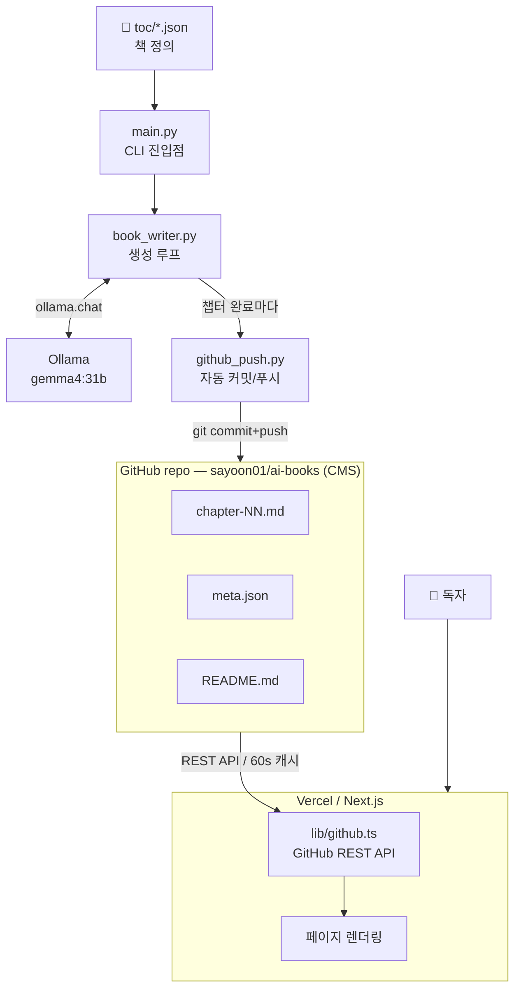
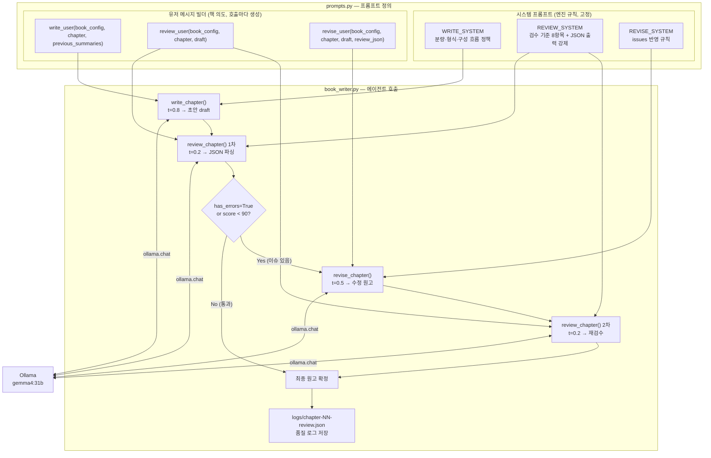
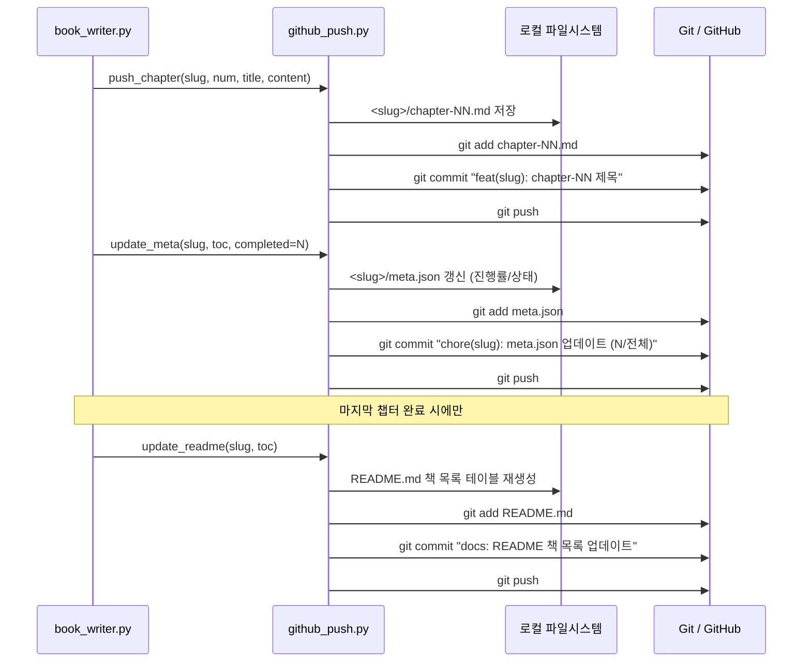

# AI Books — 프로젝트 아키텍처

## 개요

로컬 LLM(Ollama + Gemma 4 31B)으로 책을 챕터 단위로 자동 생성하고, GitHub에 커밋한 뒤 Vercel의 Next.js 앱에서 실시간으로 읽어 웹에 게시하는 파이프라인입니다.

---

## 1. 시스템 전체 흐름



---

## 2. 에이전트 파이프라인 — prompts.py × book_writer.py

`prompts.py`는 **시스템 프롬프트(엔진 규칙)** 와 **유저 메시지 빌더(책 의도)** 를 분리해 관리합니다.  
`book_writer.py`는 이를 조합해 Ollama를 호출하고, 결과를 다음 단계로 넘깁니다.



---

## 3. 챕터 완료 후 GitHub 자동 푸시

챕터 한 개가 완성될 때마다 3번의 커밋이 발생합니다.  
마지막 챕터 완료 시 README도 갱신됩니다.



---

## 디렉토리 구조

```
ai-books/
├── generator/          # 책 생성 파이프라인 (Python)
│   ├── main.py         # CLI 진입점
│   ├── book_writer.py  # 생성 로직 (에이전트 호출, 루프)
│   ├── prompts.py      # 시스템 프롬프트 + 유저 메시지 빌더
│   └── github_push.py  # Git 커밋/푸시
├── toc/                # 책 목차 정의 (JSON)
│   └── python-ml.json
├── output/             # 로컬 생성 결과물
│   └── <slug>/
│       ├── chapter-NN.md
│       └── logs/
│           └── chapter-NN-review.json  # 품질 로그
├── web/                # Next.js 프론트엔드
│   ├── app/
│   │   ├── page.tsx              # 홈 (책 목록)
│   │   └── books/[slug]/page.tsx # 책 상세 + 챕터 뷰어
│   ├── components/
│   │   ├── BookCard.tsx
│   │   └── ChapterViewer.tsx     # react-markdown 렌더러
│   └── lib/
│       └── github.ts             # GitHub REST API 클라이언트
└── <slug>/             # GitHub에 실제 올라가는 책 데이터
    ├── chapter-NN.md
    └── meta.json
```

---

## 1. 책 정의 — TOC JSON

책 한 권은 `toc/*.json` 파일 하나로 정의합니다.

```json
{
  "title": "파이썬으로 배우는 머신러닝",
  "language": "ko",
  "description": "...",
  "goal": "...",
  "target_reader": "...",
  "book_style": "...",
  "writing_guidelines": ["..."],
  "chapters": [
    { "number": 1, "title": "머신러닝이란 무엇인가", "description": "..." }
  ]
}
```

**book_config** (책의 의도) — 에이전트 유저 메시지에 전달  
`title`, `language`, `description`, `goal`, `target_reader`, `book_style`, `writing_guidelines`

**system prompt** (생성 엔진 규칙) — 하드코딩, 에이전트별 고정  
chapter 구성 흐름, 분량 정책, 출력 형식 등

---

## 2. 생성 파이프라인 — Generator

### 실행

```bash
cd /home/keti/yune/ai-books
python generator/main.py --toc toc/python-ml.json
```

### 에이전트 구조

챕터마다 최대 4단계를 거칩니다.

```
[1/4] Writer  (t=0.8)  초안 작성
[2/4] Review  (t=0.2)  JSON 검수
[3/4] Revise  (t=0.5)  이슈 반영 수정   ← score < 90 또는 has_errors 일 때만
[4/4] Review  (t=0.2)  재검수           ← Revise 실행 시만
```

초기 검수에서 `has_errors=false` & `score >= 90` 이면 Writer 결과를 바로 저장합니다.

### 에이전트별 역할

| 에이전트 | 파일 | temperature | 역할 |
|---------|------|-------------|------|
| Writer  | `prompts.py / WRITE_SYSTEM` | 0.8 | 챕터 원고 작성 |
| Review  | `prompts.py / REVIEW_SYSTEM` | 0.2 | 오류/누락/지침위반 검수, JSON 출력 |
| Revise  | `prompts.py / REVISE_SYSTEM` | 0.5 | 검수 이슈 반영 수정 |

### 챕터 간 연결 — previous_summaries

각 챕터 완료 후 `"{N}장 {제목}: {description}"` 을 리스트에 누적합니다.  
다음 챕터 Writer에게 전달해 이전 챕터에서 다룬 내용을 인식하고 중복을 방지합니다.

```python
chapter_summaries = []       # 현재: 전체 누적
# 나중에 챕터가 많아지면: chapter_summaries[-8:]  ← 한 줄만 수정
```

### Review JSON 파싱 안전장치

Gemma가 JSON 대신 자연어를 출력하는 케이스를 3단계로 처리합니다.

1. ` ```json ``` ` 블록 추출
2. `re.search(r'\{.*\}', text, re.DOTALL)` — 앞뒤 자연어 제거
3. 파싱 실패 → `has_errors=True, score=0` 으로 강제 Revise

### 품질 로그

챕터마다 `output/<slug>/logs/chapter-NN-review.json` 저장.

```json
{
  "chapter": { "number": 1, "title": "..." },
  "initial_review": { "has_errors": true, "score": 72, "issues": [...] },
  "revised": true,
  "re_review": { "has_errors": false, "score": 91, "issues": [] }
}
```

---

## 3. GitHub — CMS 역할

별도 DB 없이 GitHub 레포(`sayoon01/ai-books`)가 콘텐츠 저장소입니다.

챕터 완료마다 자동 커밋+푸시:

```
feat(<slug>): chapter-NN <제목>       ← 챕터 본문
chore(<slug>): meta.json 업데이트     ← 진행률
docs: README 책 목록 업데이트          ← 전체 책 목록 (완료 후)
```

`meta.json` 구조:

```json
{
  "title": "...",
  "language": "ko",
  "model": "gemma4:31b",
  "total_chapters": 15,
  "completed_chapters": 7,
  "status": "in_progress"
}
```

---

## 4. 웹 UI — Next.js + Vercel

GitHub REST API로 직접 파일을 읽어 렌더링합니다. 새 챕터가 푸시되면 재배포 없이 60초 캐시 만료 후 자동 반영됩니다.

### 데이터 흐름

```
GitHub REST API
  → getBooks()          루트 디렉토리 폴더 목록 → 각 meta.json
  → getChapters()       chapter-NN.md 파일 목록
  → getChapterContent() 챕터 본문 (Base64 디코딩)
```

### 페이지

| 경로 | 파일 | 역할 |
|------|------|------|
| `/` | `app/page.tsx` | 책 목록 그리드 |
| `/books/[slug]` | `app/books/[slug]/page.tsx` | 챕터 사이드바 + 본문 |

챕터 본문은 `ChapterViewer.tsx`에서 `react-markdown` + `remark-gfm` 으로 렌더링합니다.

---

## 5. 모델 설정

| 항목 | 값 |
|------|-----|
| 모델 | `gemma4:31b` (Ollama 로컬) |
| num_ctx | 32768 |
| repeat_penalty | 1.2 |
| temperature | 에이전트별 상이 (0.2 / 0.5 / 0.8) |

---

## 6. 향후 개선 계획

`FUTURE_PIPELINE_DESIGN.md` 참고 — Writer / Critic / Editor를 다른 모델로 분리하는 설계가 문서화되어 있습니다.
