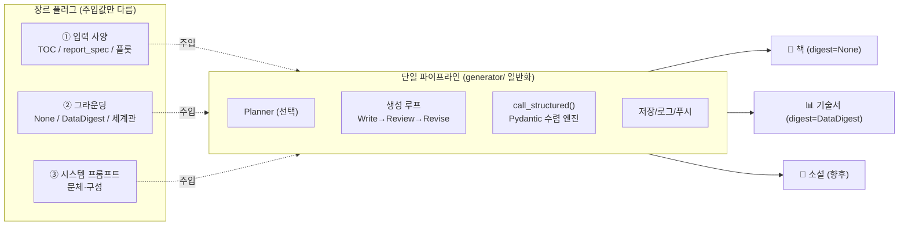
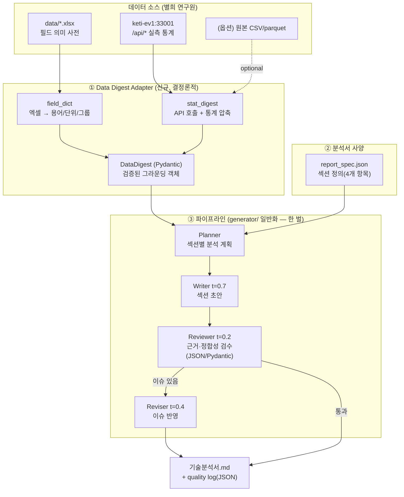

# 금형 사출 DX — 기술분석서 작성 에이전트 아키텍처 설계

> 작성일: 2026-06-11
> **개정 2026-06-11: 방향 전환** — 별도 `report_agent/` 패키지를 신규 구축하던 방침을 폐기하고, **기존 `generator/`(책 에이전트)를 일반화해 한 벌의 파이프라인으로 업그레이드**한다. 기술서는 그 일반화된 파이프라인의 한 *모드*다. (이전 전제였던 R5 "책 코드 무수정"은 폐기.) 이유: 별도 포크 시 Pydantic 수렴처럼 **책에도 이득인 개선이 책에 적용되지 않는 모순**이 생김.
> 목적: 금형 사출 데이터(금형DX 과제)를 입력받아 **기술분석서**(분석 범위 / SW 개발 방향 / 라이브러리 / 프로토타입 가능성·효과)를 자동 작성한다. 이를 위해 책 생성 파이프라인을 **장르 무관(genre-agnostic) 구조로 일반화**한다.
> 관련 문서: [ARCHITECTURE.md](ARCHITECTURE.md) · [PIPELINE.md](PIPELINE.md) · [FUTURE_PIPELINE_DESIGN.md](FUTURE_PIPELINE_DESIGN.md)

---

## 0. 한 장 요약 (TL;DR)

- **기존 `generator/`를 일반화해 업그레이드한다.** 별도 에이전트를 만드는 게 아니라, **파이프라인은 한 벌**로 두고 장르 차이를 *선택 플러그*로 흡수한다 (§3.0 포지셔닝). 기술서는 이 파이프라인에 데이터 그라운딩을 끼운 한 모드일 뿐이다.
- 이번 개선은 **책에도 그대로 이득**이다: ① **Pydantic 수렴 엔진**(`call_structured` + self-heal)이 현재 `_parse_review` 정규식 파싱을 대체하고, ② **Planner**가 Writer 앞에 선택 단계로 들어간다(책=챕터 Enricher, 기술서=섹션 설계자).
- 데이터 문서 전용 컴포넌트는 **Digest(데이터 다이제스트)** 하나다. **선택적 그라운딩 플러그** — 책은 `digest=None`(동작 그대로), 금형DX는 주입된다. 517,130 사이클의 원본을 LLM에 넣지 않고 **결정론적 코드가 통계 요약을 만들어** 검증된 단일 객체로 주입한다. 이게 "환각 없는 기술분석서"의 핵심이다.
- 별희 연구원이 준 데이터는 두 갈래다:
  - `data/241118 금형 필드 설명_수정.xlsx` → **필드 의미 사전** (스키마/용어)
  - `http://keti-ev1.iptime.org:33001/` → **실측 통계 API** (이미 분석이 끝난 결과가 JSON으로 노출됨)
- **권장**: 두 소스를 합친다. 엑셀=용어 사전(grounding dictionary), API=실측 숫자(grounding facts). API 단독·엑셀 단독 대비 장단점은 §4.
- **장기 프롬프트 체인 수렴 문제**는 단계별 출력을 **Pydantic 스키마로 강제**해서 해결한다 (현재의 정규식 JSON 파싱 대체). 책·기술서 공통 적용. §6.

---

## 1. 배경과 문제 정의

### 1.1 피드백 정리

1. 에이전트 개발 방향은 맞음 — 다만 **긴 프롬프트 체인이 수렴**하도록 Pydantic 도입을 더 고민할 것.
2. 현재처럼 **기술분석서를 작성하는 에이전트**를 계속 진행.
3. 금형 사출 데이터로 다음 4개 항목을 **에이전트가 writing** 하게 할 것:
   - 데이터 분석 범위
   - 데이터 분석 소프트웨어 개발 방향
   - 데이터 분석을 위한 세부 라이브러리 리스트
   - 일부 서비스 프로토타입 구현 가능성 + 구현 시 기대 효과
4. 데이터는 별희 연구원에게 **필드를 받거나**, 또는 **AI가 웹페이지를 읽어오게** 하는 두 방법이 있음.

### 1.2 데이터 소스 실측 (이 설계의 전제)

> 아래는 추정이 아니라 `data/` 엑셀과 `:33001` API를 실제로 조회해 확인한 사실이다.

**(A) 엑셀 — `data/241118 금형 필드 설명_수정.xlsx`**
필드 의미 사전. 본문 데이터가 아니라 컬럼 설명서다.

| 그룹 | 필드 | 의미 |
| --- | --- | --- |
| 식별 | `Cycle`, `StartTime`, `EndTime`, `Model`, `PartName`, `PartNo`, `MoldNo` | 샷 번호·시간·금형/파트 식별 |
| 소재 | `Resin`, `Grade` | 사출 플라스틱 재료/등급 |
| 조건 | `Condition`, `Sequence` | 기준 조건, 톤수·캐비티 정보 |
| 사이클 | `CycleInterval` | 사이클 타임(초). 800초+는 휴지시간 |
| 온도센서 ×8 | `T1~8_Start` / `_End` / `_Max` / `_Detect` / `_MaxDetect` | 사출 전 온도 / 추출 전 온도 / 최대온도 / 레진 도달시간 / 최대값 도달시간 |
| 압력센서 ×8 | `P1~8_Max` / `_MaxDetect` | 압력 최대값 / 도달시간 |
| 공정시간 | `ProcessTime1~6` = Fill·Pack·Cool·Opening·Ejecting·Closing | 사출/보압/냉각/형개/취출/형폐 (÷1000 = 초) |
| 기타 | `Alarms`, `Weight1/2`, `Quality`, `Worker`, `Label` | 알람 1/0, 중량, 품질, 작업자 |

**(B) 웹페이지 — `http://keti-ev1.iptime.org:33001/`**
단순 HTML이 아니라 **이미 동작 중인 분석 대시보드 + JSON API**다. (KETI 금형 사출 AI 에이전트)

| 엔드포인트 | 내용 |
| --- | --- |
| `GET /api/summary` | 총 **517,130 사이클**, cycle_type 분포(NORMAL 297,886 / SENSOR_NO_SIGNAL 170,693 / SENSOR_ERROR 36,714 / IDLE 10,115 / WARMUP 1,722), **이상 60,622건**, 평균 사이클 58.0초, 금형모델별 통계 |
| `GET /api/cycles` | 사이클 단위 레코드(원본 + 파생피처: `T_max_uniformity`, `P_max_uniformity`, `cluster`, `predicted_mold`, `mold_confidence`, `mold_mismatch`, `anomaly_category`, `fill/pack/cool_sec` …) |
| `GET /api/proc-stats` | 공정시간 통계(mean·p1·p25·p75·p99·n) |
| `GET /api/cluster-stats` | 금형별 패턴 클러스터 중심값 |
| `GET /api/correlation` | 30개 피처 상관행렬 |
| `GET /api/model-meta` | 운영 중 모델: **Isolation Forest**(이상탐지, 33피처), **Gradient Boosting**(금형식별, 45피처·29클래스) |
| `GET /api/model-eval`, `model-agg`, `mismatch-stats`, `sensor-dist`, `sensor-trend`, `ci-hist`, `wait-dist`, `uniformity` | 모델 평가·집계·금형불일치·센서분포·추이 등 |

> **설계적 함의**: 우리가 "제안"하려는 분석(이상탐지·클러스터링·금형식별·공정통계)이 **이미 레퍼런스 구현으로 존재**한다. 따라서 에이전트의 가치는 "무엇을 할 수 있나 상상"이 아니라, **실측 숫자에 근거해(grounded) 분석 범위·개발 방향·라이브러리·프로토타입 효과를 문서화**하는 데 있다. 이 점이 데이터 소스 전략(§4)과 그라운딩 전략(§5)을 결정한다.

---

## 2. 설계 목표 (Requirements)

| # | 목표 | 측정 기준 |
| --- | --- | --- |
| R1 | 4개 필수 섹션을 모두 포함한 기술분석서 생성 | 섹션 누락 0 |
| R2 | **실측 숫자에 근거**해 작성(환각 억제) | 본문 수치가 digest와 일치 |
| R3 | 긴 멀티스텝 체인이 안정적으로 수렴 | 파싱 실패율 → 0 (Pydantic 강제) |
| R4 | 데이터 소스 교체 가능(엑셀/ API/ 둘 다) | 어댑터 인터페이스 1개 |
| R5 | **단일 파이프라인** — 책·기술서가 한 벌의 코드를 공유, 차이는 선택 플러그 | 책은 `digest=None`으로 기존과 동일 동작 (회귀 0) |
| R6 | 컨텍스트 초과 방지 | 원본 미주입, digest만 주입 |

---

## 3.0 포지셔닝 — "한 벌의 파이프라인 + 장르 플러그" (중요)

이번 작업은 새 에이전트를 들이는 게 아니라 **기존 `generator/`를 장르 무관 파이프라인으로 일반화**하는 일이다. 파이프라인(Plan→Write→Review→Revise + 수렴 엔진 + 저장)은 **한 벌**이고, 장르 차이는 **세 개의 선택 플러그**로만 주입된다.



장르가 다른 점은 **세 가지 주입값뿐**이고, 나머지(루프·수렴·검수·저장)는 **같은 코드**가 처리한다.

| 장르 | ① 입력 사양 | ② 그라운딩 (digest) | ③ 시스템 프롬프트(문체/구성) |
| --- | --- | --- | --- |
| 책 | TOC 챕터 | **None** (모델 지식) | 교재 문체 |
| **기술서(이번)** | report_spec 섹션 | **DataDigest(실측)** | 기술문서 문체 |
| 소설(향후) | 플롯/캐릭터 시트 | 세계관 바이블 | 서사 문체 |

> 즉 "기술서를 추가한다"는 건 **새 패키지를 만드는 게 아니라, 일반화된 파이프라인에 위 3요소를 기술서 값으로 주입**한다는 뜻이다. 책은 `digest=None`이라 기존과 동일하게 동작한다(R5: 회귀 0). 소설도 같은 파이프라인에 값만 바꿔 끼우면 된다.

---

## 3. 전체 아키텍처 (기술서 에이전트 내부)



핵심은 세 블록이다.

1. **Data Digest Adapter (데이터 문서용 플러그)** — 데이터 소스를 추상화하고, LLM이 먹을 수 있는 **압축된 검증 객체(DataDigest)** 를 만든다. 책 모드에서는 끼우지 않는다(`digest=None`).
2. **분석서 사양(report_spec)** — 책의 TOC에 해당. 4개 필수 섹션을 정의한다. (TOC와 동일한 입력 사양 자리)
3. **파이프라인 (일반화된 generator/)** — `book_writer.py`의 Write/Review/Revise 루프를 **일반화**해 책·기술서가 공유한다. 정규식 파싱은 `call_structured`로 교체되고, 앞에 Planner가 선택 단계로 붙는다. "챕터"는 "섹션"의 한 사례일 뿐(둘 다 *unit*).

---

## 4. 데이터 소스 전략 — 3가지 옵션 비교

피드백의 "필드를 받거나 / 웹을 읽어오게 하거나"를 정식 옵션으로 정리한다.

### 옵션 A — 엑셀 필드 사전만 사용
에이전트가 **컬럼 의미만** 알고, 실측 없이 "할 수 있는 분석"을 서술.

- 👍 구현 즉시 가능(파일만 있으면 됨), 네트워크 의존 없음, 재현성 100%
- 👎 **실측 숫자가 없어 일반론에 그침** ("온도 편차로 이상탐지 가능합니다" 수준). R2(근거 기반) 미달
- 적합: 과제 착수 단계, 데이터 접근 전 초안

### 옵션 B — 웹 API 실측만 사용
에이전트가 `:33001/api/*`를 읽어 실측 통계로 작성.

- 👍 **실측 근거 확보**(517k 사이클, 이상률 11.7%, 클러스터 중심값 등). 설득력↑
- 👎 API 스키마/용어 설명이 없어 **숫자의 의미를 오독**할 수 있음(예: `P_Max` 단위, `cluster=-1`의 뜻). 서버 가용성에 의존(현재 `iptime` 내부망, 외부 도구는 HTTPS 강제로 차단됨 → 직접 HTTP 클라이언트 필요)
- 적합: 분석 결과가 이미 있고, 그걸 문서화할 때

### 옵션 C — 엑셀(사전) + API(실측) 결합 ✅ 권장
엑셀로 **용어를 해석**하고 API로 **숫자를 채운다.**

- 👍 R2 충족 + 오독 방지. "T1~8_Max(금형 캐비티 최대온도, ℃)의 균일도 `T_max_uniformity` 평균 0.41 → 캐비티 간 온도 불균형 존재" 처럼 **의미+수치 결합** 서술 가능
- 👍 API가 죽어도 엑셀 사전으로 옵션 A 폴백 가능(graceful degradation)
- 👎 어댑터 두 소스 매핑 로직 필요(필드명↔API 키 정합성)
- 적합: **본 과제 권장안**

### 비교표

| 기준 | A. 엑셀만 | B. API만 | C. 결합 |
| --- | --- | --- | --- |
| 구현 난이도 | 낮음 | 중 | 중 |
| 근거 신뢰성(R2) | 낮음 | 높음 | **가장 높음** |
| 용어 오독 위험 | 낮음 | 높음 | 낮음 |
| 외부 의존성 | 없음 | 높음 | 중(폴백 가능) |
| 산출물 깊이 | 일반론 | 수치 중심 | **수치+해석** |
| 권장도 | 착수용 | 보조 | ★ 채택 |

> **결정**: 옵션 C. 단, 어댑터를 소스-독립으로 설계해 A/B 단독으로도 동작하게 한다(R4).

---

## 5. Data Digest Adapter (가장 중요한 신규 컴포넌트)

### 5.1 왜 필요한가
- 원본은 **517,130행 × 60+컬럼** → 컨텍스트에 절대 못 넣는다(R6).
- LLM에 통계 계산을 시키면 **환각·산술오류**가 난다.
- 따라서 **결정론적 파이썬 코드가 통계를 미리 계산**하고, LLM은 그 숫자를 "해석/서술"만 한다. (계산=코드, 글쓰기=LLM 역할 분리)
- 다행히 `:33001` API가 이미 통계를 노출하므로 **대부분 호출+정규화**로 끝난다. (원본이 직접 주어지면 pandas로 동일 digest를 생성)

### 5.2 인터페이스 (소스 독립)

```python
class DigestSource(Protocol):
    def field_dictionary(self) -> dict[str, FieldSpec]: ...   # 엑셀
    def dataset_overview(self) -> Overview: ...               # /api/summary
    def process_stats(self) -> dict[str, StatBlock]: ...      # /api/proc-stats
    def correlation(self) -> CorrelationMatrix: ...           # /api/correlation
    def clusters(self) -> list[ClusterStat]: ...              # /api/cluster-stats
    def models_in_use(self) -> list[ModelMeta]: ...           # /api/model-meta

# 구현체
class ApiSource(DigestSource): ...     # http 클라이언트 (HTTP 직접, HTTPS 강제 우회)
class ExcelSource(DigestSource): ...   # openpyxl, 사전 + (있으면 원본 통계)
class CompositeSource(DigestSource):   # 옵션 C: Excel 사전 + Api 숫자 병합
    ...
```

### 5.3 산출물 — `DataDigest` (Pydantic, LLM 입력 1개)

```python
class FieldSpec(BaseModel):
    name: str
    group: Literal["id","material","condition","temp","pressure","time","etc"]
    unit: str | None
    description: str

class StatBlock(BaseModel):
    mean: float; p1: float; p25: float; p75: float; p99: float; n: int

class DataDigest(BaseModel):
    n_cycles: int                       # 517130
    period: str                         # "2023-08 ~ 2026-03"
    cycle_type_dist: dict[str, int]
    anomaly_rate: float                 # 60622 / 517130
    mold_models: list[MoldModelStat]    # 모델별 사이클/이상률/평균CT
    process_time: dict[str, StatBlock]  # fill/pack/cool/...
    top_correlations: list[tuple[str,str,float]]  # |r|>0.8 상위만
    clusters: list[ClusterStat]
    models_in_use: list[ModelMeta]      # IsolationForest, GradientBoosting
    field_dict: dict[str, FieldSpec]    # 엑셀 사전 (용어 해석용)
```

이 객체가 **유일한 그라운딩 소스**다. 프롬프트에는 `digest.model_dump_json()` 한 덩어리만 들어간다. 본문 수치는 전부 여기서 나와야 하며, Reviewer가 "digest에 없는 숫자"를 잡아낸다(R2).

---

## 6. 프롬프트 체인 수렴 — Pydantic 적용 (피드백 1번)

### 6.1 현재의 문제
지금은 Review 결과를 **정규식으로 JSON을 긁어내고**(`book_writer.py:_parse_review`), 실패하면 강제 Revise한다. 단계가 늘어날수록(Planner→Writer→Reviewer→Reviser) 이 취약성이 누적돼 **체인이 수렴하지 않는다.**

```python
# 현재 (취약): 자연어 섞인 출력을 정규식으로 도려냄
match = re.search(r'\{.*\}', text, re.DOTALL)
return json.loads(...)  # 실패 시 score=0 강제
```

### 6.2 개선 — 단계 경계마다 스키마 강제

- **출력 스키마를 Pydantic으로 정의**하고, 모델에는 `format=schema.model_json_schema()`(Ollama structured output) 또는 프롬프트에 JSON Schema를 명시 → 응답을 `Model.model_validate_json()`로 검증.
- 검증 실패 시 **에러 메시지를 모델에 되먹여 1~2회 재시도**(self-heal). 이게 "수렴"의 실체다.

```python
def call_structured(system, user, schema: type[BaseModel], retries=2):
    msg = [{"role":"system","content":system},{"role":"user","content":user}]
    for _ in range(retries+1):
        raw = ollama.chat(model=MODEL, format=schema.model_json_schema(),
                          messages=msg)["message"]["content"]
        try:
            return schema.model_validate_json(raw)        # ✅ 통과 시 종료
        except ValidationError as e:
            msg.append({"role":"assistant","content":raw})
            msg.append({"role":"user","content":f"스키마 위반:\n{e}\n같은 JSON 스키마로 다시."})
    raise ConvergenceError(schema.__name__)               # 명시적 실패
```

### 6.3 단계별 스키마

| 단계 | 입력 | 출력 스키마 |
| --- | --- | --- |
| Planner | DataDigest + report_spec | `SectionPlan{section, key_points[], required_figures[], data_refs[]}` |
| Writer | SectionPlan + digest | `SectionDraft{markdown, cited_numbers[]}` |
| Reviewer | SectionDraft + digest | `ReviewResult{has_errors, score, issues[], ungrounded_numbers[]}` |
| Reviser | Draft + ReviewResult | `SectionDraft` (동일 스키마) |

`ungrounded_numbers` = 본문에 나왔지만 digest에 없는 수치. **환각 수치 탐지 전용 필드**다(R2의 자동 검증 장치).

### 6.4 수렴 보장 규칙
- Revise는 **섹션당 최대 1회**(현재 정책 유지, 무한루프 방지).
- 모든 단계가 스키마 검증 통과해야 다음으로 진행, 2회 재시도 후에도 실패하면 해당 섹션을 "검토 필요" 플래그와 함께 저장(파이프라인 전체는 멈추지 않음).

---

## 7. 산출물 구조 — `report_spec.json`

책의 TOC에 대응. 피드백 3번의 4개 항목을 섹션으로 고정한다.

```json
{
  "title": "금형 사출 데이터 기반 분석 시스템 기술분석서",
  "audience": "과제 PM / 개발팀 / KETI 연구원",
  "grounding": "DataDigest (엑셀 사전 + :33001 API 실측)",
  "sections": [
    {"id":"scope","title":"1. 데이터 분석 범위",
     "must_cover":["대상 데이터·기간·규모","센서/공정시간 변수군","분석 가능 과제(이상탐지·금형식별·공정최적화·품질예측)","범위 밖 항목"]},
    {"id":"sw","title":"2. 데이터 분석 소프트웨어 개발 방향",
     "must_cover":["수집/적재 파이프라인","전처리·피처엔지니어링","모델링 계층","서빙/대시보드 아키텍처","MLOps·재학습"]},
    {"id":"libs","title":"3. 세부 라이브러리 리스트",
     "must_cover":["수집/IO","전처리","ML/이상탐지","시계열","시각화/대시보드","서빙","버전·근거"]},
    {"id":"proto","title":"4. 서비스 프로토타입 구현 가능성과 기대 효과",
     "must_cover":["우선순위 프로토타입 3종","구현 난이도/기간","정량 기대효과","리스크"]}
  ]
}
```

> 4번 섹션은 `:33001` 대시보드가 이미 "참조 구현"이므로, "구현 가능성"을 **실증 기반**으로 쓸 수 있다(예: "이상탐지는 IsolationForest로 이미 60,622건 검출 — 즉시 프로토타입화 가능").

---

## 8. 코드 배치 — 독립 패키지 + (선택적) 공용 코어

**기존 `generator/`(책)는 건드리지 않는다.** 기술서 엔진은 별도 디렉터리로 분리한다.

```
generator/            # 📘 책 에이전트 — 무수정 (현행 그대로)
core/                 # (선택) 공용 코어 — 책에서 추출하거나, 우선 복붙
  ├── llm.py          #   call_structured() : Pydantic 수렴 엔진
  └── loop.py         #   Writer→Review→Revise 제너릭 루프
report_agent/         # 📊 기술서 에이전트 — 이번 신규
  ├── digest/         #   Data Digest Adapter (Excel/API/Composite)
  ├── schemas.py      #   DataDigest, SectionPlan/Draft/ReviewResult
  ├── report_prompts.py
  └── generate_report.py
specs/
  └── mold_dx_report.json   # report_spec (4개 섹션)
```

책 파이프라인의 **개념 대응**(차용 대상이지, 수정 대상이 아님):

| 책 개념 | 기술서 대응 | 비고 |
| --- | --- | --- |
| `toc/*.json` | `specs/*.json` | 섹션 정의 |
| `book_config` | `DataDigest` + report meta | **데이터 그라운딩 추가** |
| `previous_summaries` | `previous_sections` | 동일 아이디어 |
| `_parse_review`(정규식) | `call_structured`(Pydantic) | **신규(책엔 역적용 안 함)** |
| `generate_book` 루프 | `generate_report` | 구조 동일, 별도 파일 |

**공용 코어 추출 시점은 선택**이다. 처음엔 `report_agent/`가 루프를 자체 보유(복붙)해 빠르게 검증하고, 책·기술서·소설 3종이 안정되면 `core/`로 리팩터링한다. (조기 추상화 회피)

---

## 9. 라이브러리 (이 에이전트 자체 구현용)

| 용도 | 라이브러리 |
| --- | --- |
| LLM 호출 | `ollama` (현행) |
| 스키마/검증 | `pydantic` v2 (피드백 1번 핵심) |
| 엑셀 사전 | `openpyxl` |
| API 클라이언트 | `httpx` (HTTP 직접 호출, 타임아웃/재시도) |
| (원본 직접분석 시) | `pandas`, `numpy`, `pyarrow` |
| 설정 | `pydantic-settings` |

> 위는 **에이전트를 만드는 데** 필요한 것. 에이전트가 **문서에 쓸** "분석용 라이브러리 리스트"(scikit-learn, river, PyOD, statsmodels, plotly/Streamlit/FastAPI 등)는 섹션 3의 산출 내용이며 digest의 `models_in_use`에 근거해 작성된다.

---

## 10. 현재 아키텍처 대비 장단점 (피드백 요구)

### 10.1 "현재 책 생성기" 대비

| 항목 | 현재(책) | 제안(기술분석서) | 평가 |
| --- | --- | --- | --- |
| 입력 | TOC 텍스트 | TOC + **데이터 digest** | 근거 기반으로 진화 |
| 사실성 | 모델 지식 의존(환각 가능) | **digest 그라운딩 + ungrounded 검출** | 👍 신뢰성↑ |
| 출력 검증 | 정규식 JSON | **Pydantic 스키마 + self-heal** | 👍 수렴성↑ |
| 단계 수 | 4 | 5(Planner 추가) | 비용↑(트레이드오프) |
| 재사용 | — | 루프·프롬프트 자산 90% 재사용 | 👍 |
| 신규 복잡도 | — | 어댑터/소스 매핑 추가 | 👎 유지보수 포인트↑ |

### 10.2 "에이전트 없이 사람이 작성" 대비
- 👍 데이터 갱신 시 **분석서 재생성 자동화**, 일관된 형식, 수치 근거 자동 인용
- 👎 도메인 깊은 통찰(금형 현장 노하우)은 여전히 사람 검토 필요 → **에이전트=초안 80%, 전문가=검수 20%** 모델 권장

### 10.3 "옵션 C(결합)" 자체의 트레이드오프
- 👍 §4 비교표대로 근거·해석 모두 최상
- 👎 `:33001` 의존(내부망/HTTPS 강제 이슈). 완화책: ① digest를 캐시(JSON 스냅샷)로 떠서 재현성 확보, ② 어댑터 폴백으로 엑셀-only 모드 지원

---

## 11. 단계별 구현 계획

| 단계 | 산출물 | 비고 |
| --- | --- | --- |
| P0 | `report_agent/` 패키지 골격 + `httpx`로 `/api/*` 스냅샷 → `digest_cache.json` | 책 코드 무수정, 서버 의존 제거 |
| P1 | `digest/` 어댑터 + `DataDigest` Pydantic 모델 | 엑셀+API 병합(옵션 C) |
| P2 | `call_structured()` + 단계 스키마 4종 | 피드백 1번(수렴) — 처음엔 report_agent 자체 보유 |
| P3 | `specs/mold_dx_report.json` + `report_prompts.py` | 4개 섹션 |
| P4 | `generate_report()` 루프 (책 루프 복붙 후 digest 연결) | 책 `generate_book`은 그대로 |
| P5 | 기술분석서 생성 → 전문가 검수 → 반영 | 사람 20% 검수 |
| P6 | (선택) 3종 안정화 후 `core/`로 공용 루프 추출 | 조기 추상화 회피 |

권장 착수 순서: **P0 → P2(수렴 엔진) → P1 → P3 → P4**. P0/P2를 먼저 하면 데이터 없이도 골격을 검증할 수 있다.

---

## 12. 리스크와 완화

| 리스크 | 영향 | 완화 |
| --- | --- | --- |
| `:33001` 가용성/내부망 한정 | digest 생성 실패 | P0 스냅샷 캐시 + 엑셀 폴백 |
| API 용어 오독(단위/`cluster=-1`) | 잘못된 서술 | 엑셀 사전으로 의미 고정, Reviewer 점검 |
| 환각 수치 | 신뢰도 하락 | `ungrounded_numbers` 자동 검출 + 1회 Revise |
| 스키마 미수렴 | 파이프라인 정지 | 2회 self-heal 후 섹션 플래그(전체는 진행) |
| 로컬 모델(gemma4:31b) 한국어 기술문서 품질 | 산출물 깊이 | 단계별 temperature 분리, 필요 시 Writer만 상위 모델로 분리(→ FUTURE_PIPELINE_DESIGN) |

---

## 부록 A. 데이터 출처 요약(실측)

- 엑셀: `data/241118 금형 필드 설명_수정.xlsx` — 필드 의미 사전(통화 메모 기반)
- API 베이스: `http://keti-ev1.iptime.org:33001/`
- 핵심 수치: 총 517,130 사이클 / 정상 297,886 / 이상 60,622(≈11.7%) / 평균 CT 58.0초 / 운영모델 IsolationForest·GradientBoosting(29 금형클래스)
- 주의: 외부 페치 도구는 HTTP→HTTPS 강제 업그레이드로 차단됨 → 어댑터는 **평문 HTTP 클라이언트**로 직접 호출해야 함.
