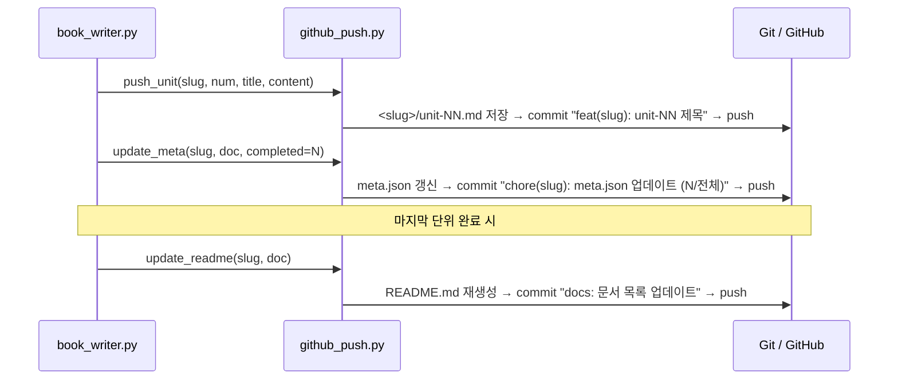

# 작성 단위 생성 파이프라인 상세 설명


문서 한 **작성 단위(unit — 챕터/섹션/장 등)** 를 완성하기까지 거치는 흐름입니다.

```
(선택) Planner → Writer → Reviewer → Reviser → Re-review
```

모든 단계는 같은 모델(gemma4:31b)을 쓰지만, 시스템 프롬프트와 temperature가 달라 역할이 분리됩니다. **장르는 코드가 아니라 `toc/*.json`이 결정**하며, `grounding`이 있으면 실측 근거가 주입됩니다.

> 옛 책 전용(4단계, 정규식 JSON 파싱)에서 일반화되었습니다: `chapters`→`units`, Planner 추가, `_parse_review`(정규식)→`call_structured`(Pydantic 수렴).

---

## 세 파일의 역할 분리

```
prompts.py        →  "LLM에게 무슨 말을 할지" (범용 시스템 프롬프트 + 유저 빌더)
book_writer.py    →  "언제, 어떤 순서로 말을 걸지" (generate() 루프)
llm.py            →  "실제로 어떻게 호출할지" (_call / call_structured)
```

### prompts.py 구조 (범용 1벌)

```
WRITE_SYSTEM    ─┐
REVIEW_SYSTEM   ─┼─ 시스템 프롬프트 (엔진 규칙, 장르 무관 고정)
REVISE_SYSTEM   ─┤   장르 색깔은 spec(description/target_reader/writing_guidelines)이 채움
PLAN_SYSTEM     ─┘

write_user()    ─┐
review_user()   ─┼─ 유저 메시지 빌더 (config + unit + grounding 텍스트 조립)
revise_user()   ─┤
plan_user()     ─┘
```

### book_writer.py 구조

```
_units(doc)      units → chapters → sections 순 폴백
_config(doc)     units/grounding 제외한 문서 설정

_plan_unit()     PLAN_SYSTEM   + plan_user()   → call_structured(UnitPlan)
_write_unit()    WRITE_SYSTEM  + write_user()  → _call() → draft
_review_unit()   REVIEW_SYSTEM + review_user() → call_structured(ReviewResult)
_revise_unit()   REVISE_SYSTEM + revise_user() → _call() → 수정 원고

generate()       단위 루프 전체 제어
                   - grounding 해소 (resolve_grounding)
                   - 분기 판단 (revise 여부)
                   - previous summaries 누적
                   - 품질 로그 저장 / GitHub 푸시
```

### llm.py — 구조화는 판단/계획 단계에만

```
_call()            자유 텍스트 생성 (Writer/Reviser — 긴 마크다운)
call_structured()  스키마 강제(format=) + 검증 실패 시 self-heal 재시도
                   (Planner/Reviewer — 짧은 JSON)
```

---

## 단위 하나의 데이터 흐름

```
[입력]
  config              = TOC에서 추출 (description / target_reader / writing_guidelines 등)
  unit                = 현재 단위 (number / title / description / must_cover?)
  grounding           = resolve_grounding(spec.grounding)  (없으면 None)
  previous_summaries  = 이전 단위 누적 목록

      │
      ▼  (선택) use_planner=True 일 때
┌─────────────────────────────────────────────────────┐
│  Planner — _plan_unit()  t=0.3                      │
│  PLAN_SYSTEM + plan_user(config, unit, prev, 근거)   │
│  → UnitPlan {key_points[], data_refs[], ...}        │
│  post_validate: data_refs ⊆ grounding.ref_keys 검증  │
└─────────────────────────────────────────────────────┘
      │
      ▼
┌─────────────────────────────────────────────────────┐
│  Writer — _write_unit()  t=0.8                      │
│  WRITE_SYSTEM + write_user(config, unit, prev, 근거) │
│  → draft (마크다운 원고)                              │
│  [근거 블록 있으면: 그 안의 수치만 인용]              │
└─────────────────────────────────────────────────────┘
      │
      ▼
┌─────────────────────────────────────────────────────┐
│  Reviewer — _review_unit()  t=0.2                   │
│  REVIEW_SYSTEM + review_user(config, unit, draft, 근거)│
│  → ReviewResult {has_errors, score 0~100,           │
│       issues[], ungrounded_numbers[]}               │
└─────────────────────────────────────────────────────┘
      │
      ├── score ≥ 90 & has_errors=False  →  final = draft (수정 없이 저장)
      │
      └── score < 90 or has_errors=True
              │
              ▼
      ┌─────────────────────────────────────────────────┐
      │  Reviser — _revise_unit()  t=0.4                │
      │  REVISE_SYSTEM + revise_user(..., review_json)  │
      │  → revised (이슈·ungrounded 반영)                │
      └─────────────────────────────────────────────────┘
              │
              ▼
      ┌─────────────────────────────────────────────────┐
      │  Re-review — _review_unit() 재검수               │
      │  결과와 무관하게 final = revised (단위당 1회)     │
      └─────────────────────────────────────────────────┘
              │
              ▼
[출력]
  output/<slug>/unit-NN.md          로컬 저장 + GitHub 커밋
  output/<slug>/logs/unit-NN-review.json  품질 로그 (plan/initial_review/revised/re_review)
  summaries += "{N}. {제목}: {description}"  (다음 단위에 전달)
```


---

## 단계별 역할 상세

### 0. Planner (t=0.3) — 작성 전 설계 (선택)

| 항목 | 내용 |
| --- | --- |
| 시스템 | `PLAN_SYSTEM` — 본문 쓰지 말고 계획만. `key_points` 3~8, `data_refs`(근거 있을 때) |
| 출력 | `UnitPlan` (Pydantic). `--planner` 플래그로 활성화 |
| 검증 | `data_refs`가 `grounding.ref_keys`에 실재하는지 코드 대조 → 환각 키 차단 |

문서 유형에 맞게 동작합니다 — 기술서면 논점, 소설이면 사건/장면 비트.

### 1. Writer (t=0.8) — 초안

| 항목 | 내용 |
| --- | --- |
| 시스템 | `WRITE_SYSTEM` — `writing_guidelines` 최우선, 근거 규칙(있으면 근거 내 수치만), 마크다운 |
| 유저 | `write_user(config, unit, previous_summaries, grounding_text)` |
| 출력 | 완결된 마크다운 원고 (`draft`) |

### 2. Reviewer (t=0.2) — 검수

| 항목 | 내용 |
| --- | --- |
| 시스템 | `REVIEW_SYSTEM` — 검수 기준 8항목 + (근거 있을 때) 환각 수치 탐지 |
| 출력 | `ReviewResult` (Pydantic, 스키마 강제) |

```jsonc
{
  "has_errors": true,
  "score": 85,                         // 0~100 (Field 제약)
  "issues": [
    {"type": "factual_error", "severity": "high",
     "problem": "...", "original_text": "...", "fix_instruction": "..."}
  ],
  "summary": "...",
  "ungrounded_numbers": ["근거에 없는 수치들"]   // grounding 있을 때만
}
```

`type`: `factual_error`·`logical_error`·`missing_content`·`guideline_violation`·`off_topic`·`inconsistency`·`unclear`·`redundancy` (Literal 강제)

**score는 LLM이 스스로 매깁니다.** 코드는 `score < 90` 또는 `has_errors=True`일 때만 Revise로 보냅니다.

```python
# book_writer.py — generate()
if review.has_errors or review.score < 90:
    revised = _revise_unit(...)
```

### 3. Reviser (t=0.4) — 이슈 반영 수정

| 항목 | 내용 |
| --- | --- |
| 시스템 | `REVISE_SYSTEM` — issues 반영, ungrounded 수치는 근거로 교체/제거, 좋은 부분 유지 |
| 출력 | 수정된 원고 (`revised`) |

### 4. Re-Review (t=0.2) — 재검수 (로그용)

- `revised`를 다시 검수하되, 결과와 무관하게 `final = revised` (단위당 1회, 무한루프 방지)
- 잔여 `high` severity 이슈는 콘솔에만 출력

---

## 프롬프트 체인 수렴 — `call_structured`

옛 `_parse_review`는 자연어 섞인 출력을 정규식으로 도려내고 실패 시 `score=0`을 강제했습니다. 단계가 늘수록(특히 Planner 추가) 이 취약성이 누적돼 체인이 수렴하지 않습니다.

`call_structured`는 단계 경계마다 **스키마를 강제**하고, 검증 실패 시 **에러를 모델에 되먹여 재시도(self-heal)**합니다.

```python
# llm.py
for _ in range(retries + 1):
    raw = ollama.chat(model=MODEL, format=schema.model_json_schema(), ...)
    try:
        obj = schema.model_validate_json(raw)
        return post_validate(obj) if post_validate else obj   # 통과 → 종료
    except (ValidationError, ValueError) as e:
        msg += [{"role":"assistant","content":raw},
                {"role":"user","content":f"검증 실패:\n{e}\n같은 스키마로 다시."}]
raise ConvergenceError(...)   # 2회 후에도 실패 → 해당 단위 플래그 후 전체는 진행
```

- **수렴 보장**: 단계당 재시도 2회, Revise 단위당 1회. 미수렴이면 그 단위만 `flagged`로 표시하고 파이프라인은 멈추지 않음.

---

## 단위 간 연결 — previous summaries


각 단위를 독립적으로 쓰면 문서 전체가 따로 놀 수 있습니다. 완성된 단위 정보를 누적해 다음 단위 Writer에게 전달합니다.

```python
# book_writer.py — generate()
summaries = []
for i, unit in enumerate(units, 1):
    ...
    draft = _write_unit(config, ctx, summaries[:], gtext)
    ...
    desc = unit.get("description") or unit.get("intent", "")
    summaries.append(f"{num}. {utitle}: {desc}")
```

누적되는 것은 실제 원고가 아니라 **TOC의 `description`(또는 `intent`)** 입니다. 단위 N을 쓸 때는 1~N-1의 요약만 전달됩니다(`summaries[:]` 복사본).

| 레이어 | 역할 |
| --- | --- |
| previous summaries | "이미 다룬 범위"를 알려 중복 억제 |
| `WRITE_SYSTEM` | "불필요한 반복 회피", "자연스럽게 이어지도록" |
| `REVIEW_SYSTEM` | 검수 기준 8 — `redundancy` |

> 단위가 많아지면 컨텍스트 보호를 위해 `summaries[:]` → `summaries[-8:]` 한 줄로 바꿀 수 있습니다.

---

## GitHub 자동 푸시 시퀀스

작성 단위 완료마다 `github_push.py`로 커밋이 발생합니다(장르 무관, 항상 켜짐).



GitHub에 푸시되면 Vercel이 REST API로 읽어 60초 캐시 만료 후 반영됩니다.

> ⚠️ `web/lib/github.ts`는 아직 `chapter-NN.md`를 읽습니다 — `unit-NN.md` 인식 갱신이 필요합니다(ARCHITECTURE.md §7).
