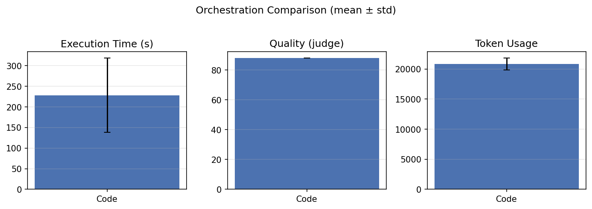
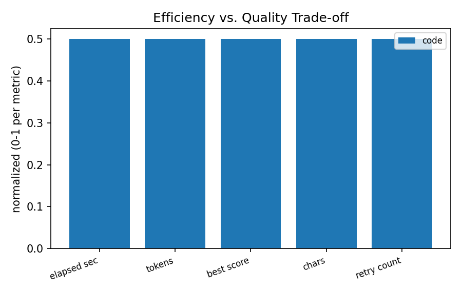
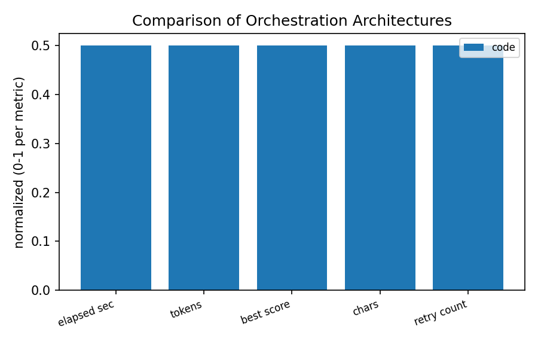
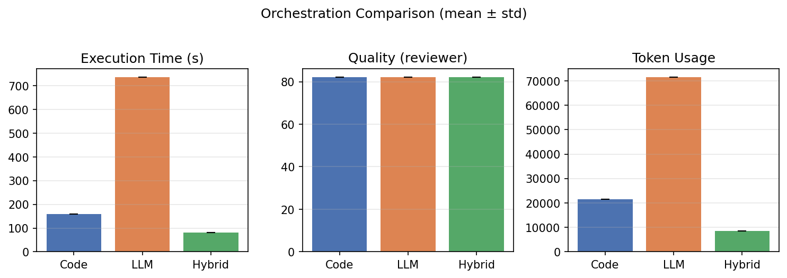

# 논문 출력 포맷 LaTeX 선정 — 보고

**날짜:** 2026-06-11
**내용:** 오케스트레이션 비교 논문, 왜 LaTeX로 바꿨는지

---

## 한 줄 요약

책·보고서는 **예전처럼 Markdown**, 학회 논문만 **LaTeX → PDF**로 뺐다.
AI 에이전트 구조는 그대로고, **제출 형식만 논문에 맞게 바꾼 것**이다.

|      | 산출물              | 포맷     | 쓰임                  |
| ---- | ------------------- | -------- | --------------------- |
| 기존 | 입문서, 현장 보고서 | Markdown | GitHub, 웹, 현장 배포 |
| 이번 | 학술대회 논문       | LaTeX    | 학회 PDF 제출         |

---

## 왜 바꿨나

지금까지는 책이랑 금형·사출 보고서를 Markdown으로 잘 만들어 왔다.
바로 읽기 좋고, 챕터 단위로 올리기도 편해서 현장용으로는 딱 맞았다.

근데 이번 **오케스트레이션 구조 비교** 연구는 학술대회(KIISE) 제출이 목표다. 학회 논문은 요구가 다르다.

- 2단 PDF
- 표·그림 번호 + 본문에서 "표 1 참조" 같은 교차 참조
- 참고문헌 형식
- **실험 숫자가 틀리면 논문 자체가 무의미**

Markdown으로도 PDF는 만들 수 있지만, 양식 맞추려면 변환 단계가 많고 표·번호가 깨지는 경우가 잦다.
논문만큼은 처음부터 LaTeX로 가는 게 낫다고 판단했다.

---

## LaTeX 고른 이유 (3가지)

### 1. 학회 제출에 맞음

LaTeX는 논문 쓸 때 사실상 표준이다. 2단 조판, 표/그림 배치, 참고문헌까지 한 번에 처리된다.

이미 손으로 쓰던 논문 초안도 LaTeX(IEEE 양식)라서, **자동 생성 결과랑 포맷을 맞출 수 있다.**

### 2. 실험 숫자를 믿을 수 있음

이 논문은 Code / LLM / Hybrid 구조별로 **시간, 토큰, 품질 점수**를 비교하는 게 핵심이다.

논문용으로는 역할을 나눴다.

- **AI** → 본문 (서론, 방법, 해석). 표 안 숫자는 직접 쓰지 않고 `\ref{tab:perf_main}`처럼 **참조만**
- **코드** → 실험 결과 JSON(`summary.json`의 `by_orchestrator`)에서 표·그래프 파일 생성

**실제로 이렇게 나온다 (파일럿 1건, Code 구조):**

| 지표      | 표에 들어간 값 | 어디서 왔나           |
| --------- | -------------- | --------------------- |
| 실행 시간 | 158.61초       | 실험 집계 `elapsed_sec` |
| 토큰      | 21,440         | 실험 집계 `tokens`    |
| 품질 점수 | 82점           | 검수 `best_score`     |
| 재시도    | 3회            | `retry_count`         |

→ `tables/tab_perf_main.tex`는 AI가 쓴 게 아니라, 위 JSON을 읽어서 코드가 `\begin{table}...\end{table}`로 뽑은 파일이다.

기존 Markdown 보고서는 AI가 본문이랑 표를 한꺼번에 썼다. 논문에서는 **표 숫자는 코드, 본문은 AI**로 분리했다.

검수 단계에서도 본문 수치를 실측 JSON과 대조한다 (`unverified_numbers` — 본문에 있는 숫자가 근거 데이터에 없으면 검수 이슈로 잡힘). 생성 모델(gemma4:31b)과 검수 모델(qwen3-coder:30b)도 분리해 둠.

### 3. 나중에 검증·수정하기 편함 — 근거가 남음

"섹션 나눠서 편하다" 수준이 아니라, **논문 한 줄마다 어디서 왔는지 추적할 수 있게** 설계해 둔 것.

**① 데이터 → 표 → 본문 참조, 3단 연결**

```
실험 결과 JSON (summary.json)
    ↓ 코드가 읽음
tables/tab_perf_main.tex  (label: tab:perf_main)
    ↓ 본문에서
sections/results.tex  ("표~\ref{tab:perf_main} 참조")
```

표 숫자를 바꾸려면 JSON만 고치고 다시 빌드하면 된다. AI가 본문에 158.61을 직접 써 놓고 표랑 어긋나는 상황을 원천적으로 막는 구조.

**② 설계안에 출처가 박혀 있음**

`plan.json`에 표·그림마다 `data_source` 필드가 있다. 예:

- `tab:perf_main` → `"실측 자료 (by_orchestrator)"`
- `fig:tradeoff` → `"실측 자료 (tokens/elapsed_sec vs best_score)"`

"이 표 뭐 기준으로 만든 거지?" 할 때 plan.json만 보면 된다.

**③ 실행 로그가 남음**

`logs/run.json`에 섹션별 검수 점수·이슈 건수·토큰 사용량이 기록된다.
실제 파일럿 기준: 초록 75점(이슈 5건), 서론 78점(이슈 6건), 총 토큰 67,728 등.

나중에 "이 문장 왜 이렇게 나왔지?" 할 때, 당시 검수 결과를 같이 볼 수 있다.

**④ LaTeX가 검증에 유리한 이유**

- 표는 `\label{tab:perf_main}`로 고정 ID → 본문 `\ref{}`와 1:1 매칭
- 표 파일(`tables/*.tex`)과 본문(`sections/*.tex`)이 분리 → 표만 따로 diff·교체 가능
- Markdown은 표가 본문 안에 섞여 있어서, 숫자 하나 고칠 때 AI가 쓴 주변 문장까지 같이 흔들리기 쉬움

**한계 (솔직히):** Code/LLM/Hybrid 3구조 전체 실험은 아직 진행 중이라, 지금 표에는 Code 1건만 들어가 있다. 실험 끝나면 같은 파이프라인으로 3구조 수치가 한 표에 채워진다.

---

## 부록: 실측 근거 자료

아래는 **실제 돌린 결과**다. (2026-06-11 기준, 작업: 금형 사출 사출기 단위 보고서 · 1챕터 · Code 구조 · 3회 반복)

### A. 실험 원시 데이터 (`runs.jsonl`)

| 반복 | 실행 시간(초) | 토큰 | 검수 점수 | Judge 점수 | 재시도 |
|------|---------------|------|-----------|------------|--------|
| 1회 | 354.94 | 22,163 | 82 | 88 | 3 |
| 2회 | 171.38 | 20,405 | 78 | 88 | 3 |
| 3회 | 158.55 | 19,937 | 82 | 88 | 3 |
| **평균±편차** | **228.3 ± 89.7** | **20,835 ± 958** | **80.7 ± 1.9** | **88 ± 0** | **3** |

→ 위 평균값이 `summary.json`으로 집계되고, 논문 표(`tab_perf_main.tex`)·그래프로 들어간다.  
(paper-agent 파일럿 표의 158.61초는 3회 중 3회차 단일 run 값이다.)

### B. 논문 자동 생성 로그 (`paper-agent` 파일럿)

| 항목 | 값 |
|------|-----|
| 생성 모델 | gemma4:31b |
| 검수 모델 | qwen3-coder:30b (생성과 분리) |
| 완료 섹션 | 초록, 서론 (2/8) |
| 초록 검수 | 75점 · 이슈 5건 · 727자 |
| 서론 검수 | 78점 · 이슈 6건 · 1,427자 |
| 총 토큰 | 67,728 (생성 28,696 + 검수 14,911 등) |

### C. 시각화 — 실험 데이터에서 코드가 뽑은 그래프

**구조별 비교 막대그래프** (`plot_results.py` → `runs.jsonl` 입력)



- 가로축: Code 구조만 (LLM·Hybrid는 실험 후 추가)
- 세 패널: 실행 시간 / Judge 품질 / 토큰
- 에러바 = 3회 반복 표준편차 (일관성 확인용)

**효율 vs 품질 트레이드오프** (`paper-agent` artifacts, 동일 JSON 기반)



- 논문 본문은 `\ref{fig:tradeoff}`로만 참조, 숫자는 그래프 파일에서 관리
- 3구조 실험이 끝나면 막대가 Code / LLM / Hybrid로 늘어남

**아키텍처 비교도** (방법 섹션용, 설계 기반)



### D. Markdown vs LaTeX — 기존에도 수치 비교는 했음 (참고)

논문 전에 Markdown으로 책을 만들 때도, **엔진별 시간·점수를 JSON으로 남기고 그래프를 뽑는** 방식을 썼다.  
(금형 사출 센서 가이드, 10챕터 · gemma4:31b)

| 엔진 | 총 소요 | 챕터당 평균 | 평균 품질점수 | 검수 패스 |
|------|---------|-------------|---------------|-----------|
| graph (고정 그래프) | 1,676초 | 167.6초 | 87.2 | 19회 |
| agent (동적 에이전트) | 1,946초 | 194.6초 | 85.9 | 22회 |

→ Markdown이든 LaTeX든 **수치는 실측·집계**가 핵심이고, 논문은 그걸 학회 PDF 형식으로 보내는 단계라고 보면 된다.

### E. 3구조 비교 완료 시 목표 형태 (참고)

전체 실험(Code / LLM / Hybrid × 반복)이 끝나면 아래처럼 **한 그림에 3구조가 나란히** 들어간다. (스모크 테스트로 미리 생성해 둔 예시)



*※ 위 그림은 파이프라인 검증용 스모크 결과이며, 최종 논문 수치는 전체 실험 완료 후 `runs.jsonl`에서 다시 생성한다.*

---

## 기존 건 그대로

LaTeX는 **논문만** 해당한다.

- AI 입문서(책) → Markdown 유지
- 금형·사출 기술 보고서 → Markdown 유지
- GitHub 공개 → 그대로

파이프라인 갈아엎은 게 아니라, **산출물 종류별로 포맷만 나눈 것**이다.

---

## 기대되는 점

1. 학회 제출용 PDF를 제대로 된 형식으로 뽑을 수 있음
2. 실험 표·그래프 숫자 신뢰도 ↑
3. 손으로 쓰던 LaTeX 초안이랑 자동 생성 결과 형식 통일 → 이중 작업 줄음
4. 지금까지 만든 Markdown 기반 성과물은 그대로 씀

---

## 미리 알아두실 것

**속도·품질이 좋아져서 바꾼 게 아님**
LaTeX가 AI를 더 빠르게 하거나 글을 더 잘 쓰게 해 주지는 않는다. PDF 조판이랑 숫자 정확도 때문이다.

**서버에 TeX 설치 필요**
PDF 빌드용 TeX Live 설치 필요 (대략 5GB). 논문 쓰는 서버 1대에 깔 예정.

**실험은 아직 진행 중**
Code / LLM / Hybrid 비교 실험이 끝나야 논문 수치가 확정된다. 지금은 파이프라인만 갖춰 둔 상태.

---

## 앞으로

| 순서 | 할 일                           | 상태      |
| ---- | ------------------------------- | --------- |
| 1    | 구조별 실험 + 수치 확정         | 진행 중   |
| 2    | LaTeX 논문 초안 자동 생성·검수 | 실험 후   |
| 3    | 학회 PDF 최종 편집·제출        | 일정 맞춰 |

실험 끝나면 본문 숫자랑 표가 실험 결과랑 맞는지 한 번 더 확인하고 공유할 예정.

---

## 정리

LaTeX는 유행 따라 바꾼 것도, 기존 시스템 통째로 갈아탄 것도 아니다.
**학회에 낼 논문이라서 제출 형식에 맞췄고, 실험 숫자를 코드로 박아 넣을 수 있게 한 것.**

책·보고서용 Markdown은 계속 쓰고, 논문만 LaTeX로 추가한 거라고 보시면 된다.
