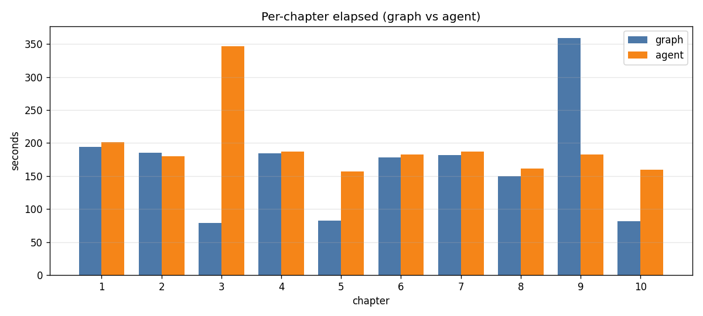
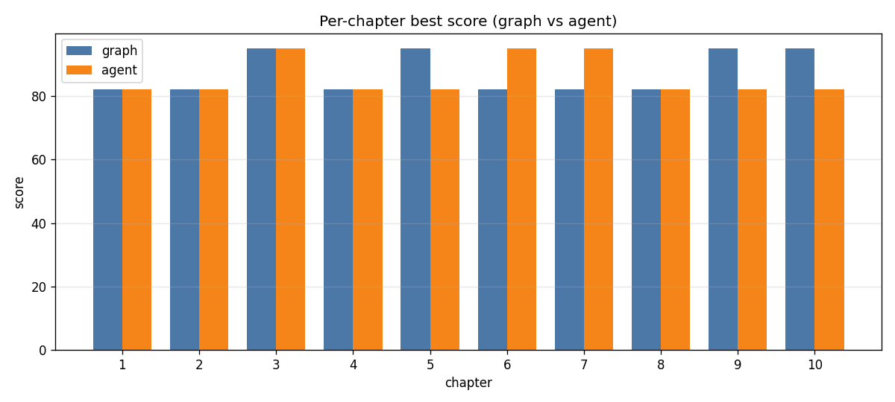
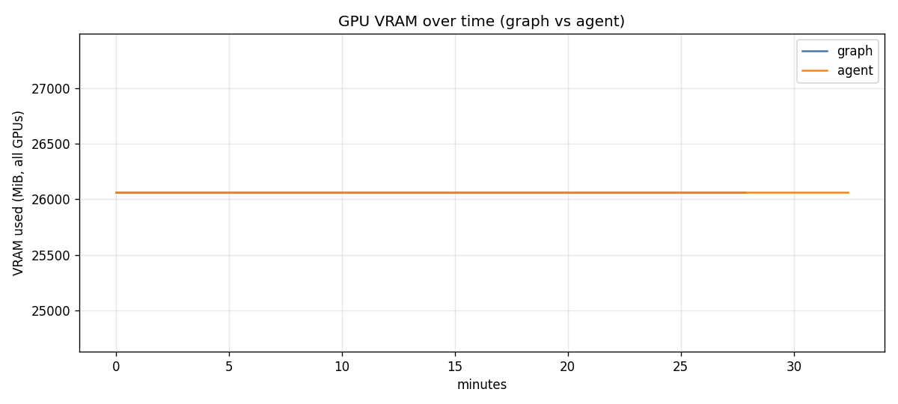

# 엔진 비교 — graph vs agent

> 챕터 생성 파이프라인을 **두 가지 오케스트레이션 방식**으로 구현해 동일 조건에서 비교.
> 같은 책(금형 사출 센서 데이터 자동 해석 가이드, 10챕터)을 같은 `design.json`·목차·grounding 으로 생성.

- 모델: `gemma4:31b`
- 공정성 통제: **동일 design.json 주입**(목차·write_brief·grounding 동일), push / pdf / trace **off**
- 실행 스크립트: `ADK_AGENT/spikes/compare_engines.py`
- 생성 시각: 2026-06-22T19:01:35
- 원자료: [`comparison_summary.json`](comparison_summary.json) · [`similarity.json`](similarity.json)

---

## 1. 두 엔진의 동작 차이

핵심: **결정 로직과 LLM 단계는 완전히 동일**하고, 오직 "흐름을 어떻게 엮느냐"만 다르다.
`write.py` / `review.py` / `revise.py` 의 순수 함수(`length_decision` / `do_review` / `gate_decision`)와
writer·reviser LlmAgent 를 **두 엔진이 공유**(단일 출처). 따라서 이 비교는 *오케스트레이션 방식 자체*의 차이를 본다.

### graph 엔진 — 선언적 그래프 (`agent/graph.py`)
`google.adk.workflow.Workflow` 의 **방향 그래프**. 노드를 엣지로 잇고, 분기는 라우팅 키로 표현.

```
START → write → length_guard → {rewrite: write, ok: review}
review → gate → {revise: revise, done: finalize}
revise → review
```

- 분기/반복이 **엣지 자료구조**로 명시됨 (`{"rewrite": write, "ok": review}`).
- 종료는 터미널 노드 `finalize` 로 라우팅해서 끝남.
- 루프 상한은 `write_count` / `pass_count` 카운터로 제어 (그래프에 별도 루프 상한 노드 없음).

### agent 엔진 — 코드 오케스트레이션 (`agent/agents.py`)
ADK 표준 `SequentialAgent` + `LoopAgent` **합성**. 같은 흐름을 "에이전트 중첩"으로 표현.

```
SequentialAgent[
    LoopAgent("draft",  [writer, LengthGate],          max=WRITE_MAX(3))    # 길이 충족까지 재작성
    LoopAgent("refine", [Reviewer, Gate, reviser],     max=PASS_MAX+2(5))   # 통과/수용까지 수정
]
```

- 반복은 `LoopAgent`, 순서는 `SequentialAgent` 가 담당.
- 루프 탈출은 **escalate 신호**로 제어:
  - `LengthGate`: 길이 OK 면 `escalate` → draft 루프 종료(부모 Sequential 은 refine 으로 진행).
  - `Gate`: 완료/수용이면 `escalate` → refine 루프 종료(reviser 건너뜀).
- 커스텀 `BaseAgent` 의 state 변경은 **`EventActions(state_delta=...)` 로만 영속**(직접 대입은 휘발) — ADK 제약.

### 한눈에

| 측면 | **graph** | **agent** |
|---|---|---|
| 구현 | `Workflow(edges=[...])` 선언적 그래프 | `SequentialAgent`+`LoopAgent` 코드 합성 |
| 분기 표현 | 라우팅 키 (`rewrite`/`ok`, `revise`/`done`) | escalate 신호로 루프 탈출 |
| 종료 | 터미널 노드 `finalize` | escalate + `max_iterations` backstop |
| 반복 상한 | 카운터(`write_count`/`pass_count`) | `LoopAgent.max_iterations` + 카운터 |
| 결정 로직 | **공유** (`write/review/revise.py` 순수 함수) | **공유** (동일) |
| LLM 단계 | **공유** (writer/reviser LlmAgent) | **공유** (동일) |

> 즉 graph 는 "지도(엣지)를 그려놓고 흐르게" 하고, agent 는 "루프/순서 에이전트를 코드로 중첩"한다.
> 흐름·게이트·keep-best 결과는 같게 설계됐고, 차이는 **반복 루프가 도는 횟수의 변동성**에서 주로 발생.

---

## 2. 종합 결과 — graph 근소 우위

| 지표 | **graph** | **agent** | 우위 |
|---|---|---|---|
| 총 소요(초) | **1675.6** (~28분) | 1946.2 (~32분) | graph (16%↓) |
| 평균 초/챕터 | **167.6** | 194.6 | graph |
| 평균 best score | **87.2** | 85.9 | graph |
| 최저 best score | 82 | 82 | = |
| flagged 챕터 수 | 0 | 0 | = |
| 총 초안 재작성(write) | 10 | 10 | = |
| 총 재검수(review pass) | **19** | 22 | graph |




**해석**
- **품질은 사실상 동등** — 평균 1.3점 차, 최저점·flagged·초안수 모두 동일. 같은 grounding 으로 같은 수준의 책 생성.
- **graph 가 더 빠르고 재검수를 덜 함** — agent 가 refine 루프를 3패스 더 돎(특히 ch3). 시간 차의 대부분이 여기서 발생.
- 다만 **루프 변동성은 양쪽 다 존재** — graph 도 ch9 에서 4패스(358.9초)로 튐. 어느 엔진이든 특정 챕터에서 재수정이 길어질 수 있음.

---

## 3. GPU

| 엔진 | gpu0 mem(avg/max) | gpu0 util(avg/max) | gpu1 |
|---|---|---|---|
| graph | 26045 / 26045 MiB | 94% / 97% | 유휴 (15MiB, 0%) |
| agent | 26045 / 26045 MiB | 94% / 99% | 유휴 (15MiB, 0%) |

**자원 사용은 사실상 동일.** 둘 다 단일 GPU(gpu0)에 26GB·util 94% 로 동일하게 적재.
→ 시간/품질 차이는 GPU 자원이 아니라 **순수 오케스트레이션 효율(루프 횟수)** 에서 나옴.



---

## 4. 내용 유사도 ([`similarity.json`](similarity.json))

| 지표 | 값 |
|---|---|
| 평균 seq_ratio | 0.176 |
| 평균 jaccard | 0.274 |
| 판정 | **유의미하게 다름** |

같은 design·grounding 을 줘도 **두 엔진의 본문 텍스트는 꽤 다르다**(seq_ratio 0.18, jaccard 0.27).
즉 흐름은 같아도 LLM 생성·재수정 경로가 달라 결과 문장은 갈라진다. 길이는 비슷(len_pct 80~98%).
→ "어느 쪽이 더 잘 썼나"는 자동 지표만으로 못 가르고, **블라인드 심사**가 필요(현재 평균 score 로는 graph 근소 우위).

---

## 5. 챕터별 상세

### graph

| ch | score | sec | write | review pass | flagged |
|---|---|---|---|---|---|
| 1 | 82 | 194.5 | 1 | 2 | - |
| 2 | 82 | 185.5 | 1 | 2 | - |
| 3 | 95 | 78.7 | 1 | 1 | - |
| 4 | 82 | 184.4 | 1 | 2 | - |
| 5 | 95 | 82.8 | 1 | 1 | - |
| 6 | 82 | 178.0 | 1 | 2 | - |
| 7 | 82 | 181.7 | 1 | 2 | - |
| 8 | 82 | 149.6 | 1 | 2 | - |
| 9 | 95 | 358.9 | 1 | 4 | - |
| 10 | 95 | 81.4 | 1 | 1 | - |

### agent

| ch | score | sec | write | review pass | flagged |
|---|---|---|---|---|---|
| 1 | 82 | 200.8 | 1 | 2 | - |
| 2 | 82 | 180.1 | 1 | 2 | - |
| 3 | 95 | 346.9 | 1 | 4 | - |
| 4 | 82 | 187.3 | 1 | 2 | - |
| 5 | 82 | 157.2 | 1 | 2 | - |
| 6 | 95 | 182.9 | 1 | 2 | - |
| 7 | 95 | 187.2 | 1 | 2 | - |
| 8 | 82 | 161.4 | 1 | 2 | - |
| 9 | 82 | 182.6 | 1 | 2 | - |
| 10 | 82 | 159.8 | 1 | 2 | - |

---

## 6. 블라인드 페어와이즈 심사 (독립 심사자) — 5:5 동점

자동 점수(`do_review`)는 두 엔진이 **공유**하는 자기채점이라 품질 신호가 약하다(§4.2).
이를 보강하기 위해 **독립 심사자**에 의한 블라인드 페어와이즈 심사를 수행했다.

- **심사자:** Claude Opus 4.8 — 생성기 `gemma4:31b`와 **완전히 다른 모델 계열**(자기채점 편향 없음)
- **블라인드 설계:** 챕터별 두 엔진 산출물을 A/B 라벨로 섞고 매핑은 `_key.json`에 격리,
  심사 종료 후 공개. **A 배정 균형**(graph=A 5개 / agent=A 5개)으로 위치 편향 상쇄.
- **원자료:** [`blind_judging.json`](blind_judging.json)

| ch | 승자 엔진 | 핵심 근거 |
|---|---|---|
| 1 | agent | 필드정의 섹션 추가 + 미정의 필드(Weight1/Quality) 임의정의 거부(grounding) |
| 2 | agent | graph가 `_Min` 접미사를 근거 없이 도입 |
| 3 | graph | 내용 동급, agent쪽 표에 `\lor` LaTeX 누출 |
| 4 | agent | NORMAL↔IDLE 비교표 + 분위수 산출 caveat |
| 5 | graph | 운영상태 연계 + NaN→0→저수치 3단계 프레이밍 |
| 6 | graph | T_Detect=0=미감지 명확화 + Frozen Layer 물리 |
| 7 | agent | 전단가열 등 도메인 깊이 / graph에 `SENSORS_ERROR` 오타 |
| 8 | graph | 미장착=Column·센서오류=Row 통찰 / agent에 `\max` 누출 |
| 9 | agent | graph에 **검수 대화 누출**(작업요약·"작업을 종료하겠습니다") — 가장 치명적 |
| 10 | graph | 미장착 오류율 제외 + 흐름/품질 2축 / graph에 사소한 `50\%` |

**결과: graph 5승(3·5·6·8·10) · agent 5승(1·2·4·7·9) → 정확히 동점.**

**해석**
- **품질은 통계적으로 대등.** 자동 점수(87.2 vs 85.9)·flagged 0·블라인드 5:5가 모두 같은 결론.
  "graph가 품질도 우위"라던 자동 점수는 자기채점이라 약했고, 독립 심사로는 **우열 없음**이 맞다.
- **결함은 양쪽에 분산** — 어느 엔진도 더 깨끗하지 않다. 가장 심각한 **검수 대화 누출(ch9)은 graph**,
  LaTeX 누출은 양쪽(agent ch3·ch8, graph ch10), 오타도 양쪽. → 후처리(정제) 가드 부족은
  **엔진 무관 공통 개선과제**(reviewer/정제 단계 강화 필요).
- ⚠️ **한계:** 단일 심사자·1패스. 더 엄밀히 하려면 다심사자 패널(예: + Qwen3.5-27B)·양방향 위치 스왑 재심사로
  표본을 키울 수 있으나, 현재 5:5 동점은 신호가 충분히 명확하다.

> **함의:** 품질이 동점이므로 엔진 결정은 **속도·API 현행성·유지보수**로 환원되고(§3.5 동일 논리),
> 이는 전부 graph 우위 → 블라인드 심사가 **graph 권고를 추가로 뒷받침**한다.

## 7. 결론 / 권고

- **graph 엔진을 기본값으로 유지** — 더 빠르고(16%↓) 재검수도 덜 돌면서 품질은 **동등**(블라인드 5:5).
- agent 엔진은 ADK 표준 구성요소(`SequentialAgent`/`LoopAgent`)로 같은 결과를 재현 가능함을 입증 →
  표준 패턴이 필요한 환경(타 ADK 도구/관측 연동)에서 대안으로 보유할 가치 있음.
- 품질 우열은 **블라인드 독립 심사로 동점 확정**(§6) → 결정은 속도·API·유지보수로 환원, 전부 graph 우위.
- **공통 개선과제(엔진 무관):** ch9 검수 대화 누출·LaTeX 누출 등 → reviewer/정제 단계의 후처리 가드 강화.

> 생성 산출물 원본(두 엔진의 챕터 md, 로그)은 로컬 `ADK_AGENT/output/_compare/` 에 있음(GitHub 미추적).
