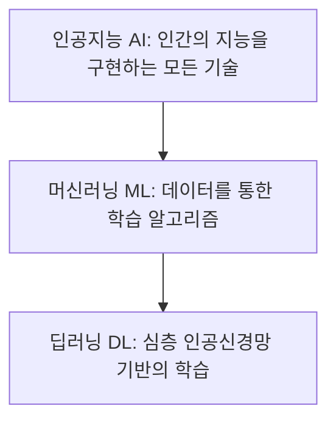

# 챕터 1: 머신러닝이란 무엇인가

# 1. 머신러닝이란 무엇인가

## 1.1 경험으로 배우는 기계: 머신러닝의 정의

### 🍎 아이가 사과를 배우는 방법
우리가 어린아이에게 '사과'가 무엇인지 가르친다고 가정해 봅시다. 우리는 아이에게 사과의 생물학적 정의나 기하학적인 수치를 알려주지 않습니다. "사과는 지름이 8cm이며, 색상 코드 #FF0000이고, 당도가 12브릭스 이상인 구형의 과일이란다"라고 설명하는 어른은 없습니다.

대신 우리는 아이에게 실제 사과를 보여주며 이렇게 말합니다. 
"이게 사과야."
"이 빨간 것도 사과고, 이 초록색 것도 사과야."
"하지만 이건 배니까 사과가 아니야."

아이는 여러 개의 사과를 보면서 스스로 공통점을 찾아냅니다. '둥글다', '특유의 색깔이 있다', '꼭지가 달려 있다' 같은 특징들을 뇌 속에 저장하죠. 나중에 아이가 처음 보는 사과를 마주했을 때, 과거에 보았던 사과들의 특징과 비교하여 "이건 사과예요!"라고 정답을 맞히게 됩니다. 이것이 바로 '학습'입니다.

### 💡 직관으로 이해하는 머신러닝
머신러닝(Machine Learning, 기계 학습)은 바로 이 아이의 학습 방식을 컴퓨터에 적용한 것입니다. 

전통적인 컴퓨터 프로그램은 사람이 정해준 규칙을 그대로 따르는 '성실한 일꾼'과 같았습니다. 하지만 세상에는 규칙으로 설명하기 너무 복잡한 일들이 많습니다. 예를 들어, 수만 가지 종류의 강아지 사진을 보고 모두 '강아지'라고 판별하게 하려면, 사람이 일일이 "귀가 뾰족하고 털이 있고 코가 촉촉하면 강아지다"라는 규칙을 적어줄 수 없습니다. 강아지의 종류마다 생김새가 너무나 다르기 때문입니다.

머신러닝은 규칙을 직접 입력하는 대신, **'데이터'라는 경험**을 줍니다. 컴퓨터가 수많은 데이터를 통해 스스로 패턴을 찾아내고, 그 패턴을 바탕으로 새로운 데이터가 들어왔을 때 결과를 예측하게 만드는 기술입니다.

### 🛠️ 기술적 정의
기술적으로 머신러닝은 **"명시적으로 프로그래밍되지 않고도 컴퓨터가 학습할 수 있도록 하는 알고리즘과 기술"**을 의미합니다.

여기서 핵심은 '명시적 프로그래밍'의 부재입니다. 개발자가 `if-else` 문을 사용하여 모든 경우의 수를 정의하는 것이 아니라, 데이터를 통해 최적의 통계적 모델을 찾아내는 과정입니다. 머신러닝의 일반적인 작동 프로세스는 다음과 같습니다.

1.  **데이터 수집**: 학습에 필요한 많은 양의 데이터를 모읍니다.
2.  **특징 추출**: 데이터에서 정답을 결정짓는 중요한 요소(Feature)를 찾아냅니다.
3.  **모델 학습**: 알고리즘을 통해 데이터와 정답 사이의 관계(패턴)를 수학적 함수로 만듭니다.
4.  **예측 및 평가**: 학습되지 않은 새로운 데이터를 넣어 정답을 맞히는지 확인합니다.

---

## 1.2 전통적 프로그래밍 vs 머신러닝

### 🍳 레시피대로 요리하기 vs 맛을 보며 간 맞추기
전통적인 프로그래밍은 **'완벽한 레시피'**를 작성하는 것과 같습니다. 
"소금 5g을 넣고, 3분간 끓인 뒤, 불을 끈다." 이 레시피대로만 하면 누구나 똑같은 맛의 요리를 만들 수 있습니다. 하지만 재료의 상태(데이터)가 바뀌면(예: 소금이 평소보다 훨씬 짜다면) 결과물은 망가지게 됩니다. 레시피를 수정하기 전까지는 계속 짠 요리가 나오겠죠.

반면, 머신러닝은 **'맛을 보며 간을 맞추는 요리사'**와 같습니다.
요리사는 국물을 한 숟가락 떠서 맛을 봅니다. "음, 좀 싱거운데?"라고 판단하고 소금을 조금 더 넣습니다. 다시 맛을 봅니다. "이제 딱 맞네!" 이 과정은 '현재 상태(데이터)'와 '목표 맛(정답)' 사이의 차이를 줄여나가는 반복적인 학습 과정입니다.

### 🔍 직관적 차이: 무엇을 입력하고 무엇을 얻는가?
두 방식의 가장 결정적인 차이는 **'규칙(Rule)'**이 어디서 오느냐에 있습니다.

*   **전통적 프로그래밍**: 사람이 규칙을 만들고, 데이터를 넣으면 결과가 나옵니다.
    *   `규칙(Rule) + 데이터(Data) $\rightarrow$ 결과(Answer)`
*   **머신러닝**: 데이터와 결과를 넣으면, 컴퓨터가 규칙을 찾아냅니다.
    *   `데이터(Data) + 결과(Answer) $\rightarrow$ 규칙(Rule)`

### 📊 비교 분석표

| 구분 | 전통적 프로그래밍 (Traditional Programming) | 머신러닝 (Machine Learning) |
| :--- | :--- | :--- |
| **핵심 동력** | 사람이 정의한 논리와 규칙 | 데이터 속에 숨겨진 패턴과 통계 |
| **접근 방식** | 연역적 (Deductive): 규칙 $\rightarrow$ 결과 | 귀납적 (Inductive): 사례 $\rightarrow$ 규칙 |
| **유연성** | 규칙 외의 상황이 발생하면 오류 발생 | 새로운 데이터에 적응하며 성능 향상 가능 |
| **적합한 작업** | 세금 계산, 은행 송금 등 명확한 규칙이 있는 작업 | 얼굴 인식, 번역, 추천 등 규칙화하기 어려운 작업 |
| **개발자 역할** | 모든 예외 상황을 고려하여 로직 설계 | 양질의 데이터를 수집하고 적절한 모델 선택 |

---

## 1.3 AI, 머신러닝, 딥러닝의 관계

### 🪆 마트료시카 인형
러시아의 전통 인형인 '마트료시카'를 떠올려 보세요. 큰 인형 속에 중간 인형이 있고, 그 속에 다시 작은 인형이 들어있습니다. 인공지능, 머신러닝, 딥러닝의 관계가 바로 이와 같습니다.

1.  **가장 큰 인형: 인공지능 (Artificial Intelligence, AI)**
    인간의 지능을 흉내 내는 모든 기술을 통칭합니다. 아주 단순한 `if-else` 규칙 기반의 챗봇부터 복잡한 자율주행 자동차까지 모두 AI에 포함됩니다.
2.  **중간 인형: 머신러닝 (Machine Learning, ML)**
    AI의 한 분야로, 데이터를 통해 스스로 학습하는 능력을 갖춘 알고리즘들을 말합니다. "명시적인 프로그래밍 없이 학습한다"는 특징을 가진 모든 기법이 여기 속합니다.
3.  **가장 작은 인형: 딥러닝 (Deep Learning, DL)**
    머신러닝의 한 종류로, 인간의 뇌 구조를 모방한 '인공신경망(Artificial Neural Networks)'을 층층이 쌓아(Deep) 학습하는 방식입니다. 이미지 인식이나 자연어 처리(ChatGPT 등)에서 압도적인 성능을 발휘합니다.

### 🖼️ 개념 도식화



*   **AI $\supset$ ML $\supset$ DL** 관계입니다.
*   따라서 "딥러닝 모델을 사용한다"는 말은 곧 "머신러닝을 사용한다"는 말이며, 동시에 "인공지능 기술을 사용한다"는 말과 같습니다. 하지만 역은 성립하지 않습니다. (모든 AI가 딥러닝인 것은 아닙니다.)

---

## 1.4 실무 활용 사례: 추천 시스템과 스팸 필터

머신러닝은 이미 우리 일상 깊숙이 들어와 있습니다. 가장 대표적인 두 가지 사례를 통해 머신러닝이 어떻게 작동하는지 살펴보겠습니다.

### 🎬 넷플릭스와 유튜브의 추천 시스템 (Recommendation System)
우리가 유튜브 홈 화면을 켰을 때, 내가 좋아할 만한 영상들이 나열되는 것은 머신러닝의 결과입니다.

*   **데이터**: 내가 클릭한 영상, 시청 시간, '좋아요'를 누른 영상, 검색어 등.
*   **학습 과정**: 머신러닝 모델은 수백만 명의 사용자 데이터를 분석합니다. "A 영상을 본 사람들은 보통 B 영상도 보더라" 혹은 "C 사용자와 D 사용자는 취향이 매우 비슷하구나"라는 패턴을 찾아냅니다.
*   **예측**: 내가 방금 '파이썬 기초' 영상을 봤다면, 모델은 "이 사용자는 파이썬 기초를 봤으니, 다음으로는 '머신러닝 입문' 영상을 좋아할 확률이 90%다"라고 예측하여 추천 목록에 올립니다.

### 📧 지메일(Gmail)의 스팸 필터 (Spam Filter)
매일 수많은 메일이 오지만, 스팸 메일은 자동으로 스팸함으로 들어갑니다. 어떻게 가능할까요?

*   **데이터**: 수억 개의 '정상 메일'과 '스팸 메일' 텍스트 데이터.
*   **학습 과정**: 모델은 스팸 메일에 자주 등장하는 단어들의 패턴을 분석합니다. 예를 들어, `광고`, `무료`, `당첨`, `최저가`, `비트코인` 같은 단어가 많이 포함되어 있고, 발신자 주소가 무작위 문자열인 경우 스팸일 확률이 높다는 것을 학습합니다.
*   **예측**: 새로운 메일이 도착하면, 학습된 패턴과 비교합니다. "이 메일은 '무료'라는 단어가 5번 등장하고 발신자가 불분명하므로, 스팸일 확률이 98%다"라고 판단하여 스팸함으로 보냅니다.

---

## 1.5 [실습] 파이썬으로 맛보는 첫 번째 머신러닝

이제 이론을 넘어 실제로 코드를 작성해 보겠습니다. 복잡한 수학 없이, 파이썬의 대표적인 머신러닝 라이브러리인 `scikit-learn`을 사용하여 간단한 **'과일 분류기'**를 만들어 보겠습니다.

### 🍎 과일 분류 시나리오
우리는 과일의 **'무게'**와 **'표면의 거칠기'** 데이터를 통해 이 과일이 **'사과'**인지 **'오렌지'**인지 맞히는 모델을 만들 것입니다.

*   **특징(Feature)**: 무게(g), 거칠기(1: 매끄러움 $\rightarrow$ 10: 거침)
*   **정답(Label)**: 0(사과), 1(오렌지)

### 💻 실행 코드

```python
# 필요한 라이브러리 설치 (터미널에서 실행: pip install scikit-learn)
from sklearn import tree

# 1. 데이터 준비 (경험 데이터)
# [무게, 거칠기]
features = [
    [140, 3], [130, 3], [150, 4], [170, 7], [160, 8], [180, 9]
]
# 0: 사과, 1: 오렌지
labels = [0, 0, 0, 1, 1, 1]

# 2. 모델 선택 (결정 트리 알고리즘 사용)
# 결정 트리는 스무고개처럼 질문을 던져 정답을 찾는 모델입니다.
clf = tree.DecisionTreeClassifier()

# 3. 모델 학습 (데이터와 정답을 주고 패턴을 찾게 함)
clf.fit(features, labels)

# 4. 새로운 데이터로 예측하기
# 무게 155g, 거칠기 6인 과일은 무엇일까요?
new_fruit = [[155, 6]]
prediction = clf.predict(new_fruit)

# 결과 출력
fruit_name = "오렌지" if prediction[0] == 1 else "사과"
print(f"예측 결과: 이 과일은 [{fruit_name}]입니다.")

# 추가 예측: 무게 135g, 거칠기 2인 과일은?
new_fruit_2 = [[135, 2]]
prediction_2 = clf.predict(new_fruit_2)
fruit_name_2 = "오렌지" if prediction_2[0] == 1 else "사과"
print(f"예측 결과: 이 과일은 [{fruit_name_2}]입니다.")
```

### 📈 결과 해석

**실행 결과:**
```text
예측 결과: 이 과일은 [오렌지]입니다.
예측 결과: 이 과일은 [사과]입니다.
```

**왜 이런 결과가 나왔을까요?**
1.  **패턴 발견**: 모델은 학습 데이터(`features`, `labels`)를 통해 다음과 같은 규칙을 스스로 발견했을 것입니다.
    *   "무게가 150g보다 무겁고 거칠기가 5보다 크면 $\rightarrow$ 오렌지일 가능성이 높다."
    *   "무게가 150g보다 가볍고 거칠기가 5보다 작으면 $\rightarrow$ 사과일 가능성이 높다."
2.  **적용**: 첫 번째 테스트 데이터 `[155, 6]`은 모델이 찾은 '오렌지'의 특성에 부합하므로 오렌지로 예측했습니다. 두 번째 데이터 `[135, 2]`는 '사과'의 특성에 가깝기 때문에 사과로 예측한 것입니다.

---

## 1.6 초보자가 자주 하는 실수와 해결 방법

머신러닝을 처음 접할 때 많은 입문자가 빠지는 함정들이 있습니다.

### ❌ 실수 1: "데이터만 많으면 무조건 성능이 좋아진다"
많은 이들이 데이터의 '양'에만 집착합니다. 하지만 쓰레기를 넣으면 쓰레기가 나오는 **GIGO(Garbage In, Garbage Out)** 원칙이 머신러닝에서도 그대로 적용됩니다.
*   **해결 방법**: 데이터의 양보다 **'질'**이 중요합니다. 잘못 측정된 데이터, 중복된 데이터, 정답이 틀린 데이터를 걸러내는 '데이터 전처리' 과정에 더 많은 시간을 투자하세요.

### ❌ 실수 2: "머신러닝은 마법의 상자다"
코드를 실행해서 정답이 나왔다고 해서 모델이 완벽하게 이해했다고 생각하는 경우입니다. 머신러닝은 통계적 확률에 기반합니다.
*   **해결 방법**: 모델이 왜 이런 결과를 냈는지 분석하는 **'설명 가능한 AI(XAI)'** 관점을 가져야 합니다. 위 실습에서도 단순히 결과만 보는 것이 아니라, 모델이 어떤 기준(무게인지, 거칠기인지)으로 분류했는지 확인하는 습관이 필요합니다.

### ❌ 실수 3: "학습 데이터에서 100% 정답을 맞히면 성공이다"
학습 데이터에 너무 과하게 최적화되어, 정작 새로운 데이터가 들어왔을 때는 엉뚱한 답을 내놓는 현상이 발생합니다. 이를 **'과적합(Overfitting)'**이라고 합니다.
*   **해결 방법**: 데이터를 '학습용'과 '검증용'으로 나누어, 학습에 사용하지 않은 데이터로 모델의 진짜 실력을 테스트해야 합니다. (이 내용은 이후 챕터에서 자세히 다룹니다.)

---

## 1.7 요약 및 정리

이번 장에서는 머신러닝의 기본 개념과 정체성에 대해 알아보았습니다.

*   **머신러닝**은 명시적인 규칙 대신 데이터(경험)를 통해 스스로 패턴을 학습하는 기술입니다.
*   **전통적 프로그래밍**이 `규칙 + 데이터 $\rightarrow$ 결과`라면, **머신러닝**은 `데이터 + 결과 $\rightarrow$ 규칙`의 흐름을 가집니다.
*   **AI $\supset$ ML $\supset$ DL**의 계층 구조를 가지며, 딥러닝은 인공신경망을 이용한 머신러닝의 심화 버전입니다.
*   추천 시스템, 스팸 필터처럼 규칙을 일일이 정하기 어려운 복잡한 문제 해결에 탁월한 성능을 보입니다.
*   머신러닝의 핵심은 **양질의 데이터**를 통해 **일반화된 규칙**을 찾아내는 것입니다.

이제 머신러닝이 무엇인지 알게 되었습니다. 다음 장에서는 머신러닝의 세 가지 큰 갈래인 '지도 학습', '비지도 학습', '강화 학습'에 대해 자세히 살펴보겠습니다.